# Design Doc

## Table of Contents

1. [About](#about)
2. [Learnings](#learnings)
3. [Code Notes](#code-notes)
4. [Achievements](#achievements)
5. [Rich Presence](#rich-presence)

## About

* [Wikipedia](https://en.wikipedia.org/wiki/Monster_Max)
* [RetroAchievements](https://retroachievements.org/game/4111)
* [Walkthrough](https://gamefaqs.gamespot.com/gameboy/585809-monster-max/faqs/36096)
* [YouTube Video Playthrough](https://www.youtube.com/watch?v=p4EVqKSPrcs)

## Learnings

### Passwords

While playing through the game there is no save state for it, meaning if you play a few levels and want to quit and come back at a later time, the only way to "restore" your progress is by using the password system. The password system will place you at a specific point in the game. As far as i can tell passwords are characteristics of the player encoded. the values that are encoded seem to be a combination of: credits, levels completed, number of stars, and level pass obtained. Through some trial and error unfortunately I am unable to convert these values into passwords to try and thrwart the password system abuse for acheivements. There are no set passwords in the game, only the ability to enter 8 characters that can be any of the 32 characters supported in the system, making the game have thousands of passwords to chose from so hard coding password protection is not going to happen with no reliable way to generate passwords from the characteristics provided.

Playing with passwords seems to create a new password hash any time one of those characteristics changes, but when loading the game state in the game, it removes all lucky stars. You can never enter a password and get stars or specific items in your slots. the only thing that matters is lift pass level, missions completed flags, and credits. Also while playing with the password system it appears that there is some level of anti-cheat in the game. meaning you cant start the game with 9999 credits, you will need to enter a password hash that makes a valid game state. I do notice that some of the credits I manually calculate for what you can have at that point in the game differ from what passwords allow. This may be a buffer by the developers for some reason as I see no way to earn these extra points in the game. I will note what each levels max points can be with passwords in the Level details section below.

### Levels

There is 1 play pen, 9 levels with 3 missions each, and a final 10th level with one mission to complete the game. players cant move up to the next level unless the gather credits by completing missions on the floors they have access to. there is a way around completing levels by using passwords, either using one of the well known passwords on the internet to go to the end of the game and have all the lift passes, or getting a password that just gives you all the lift passes for free.

### Stars

Stars are accumulated by collecting them in the missions and displayed as a number in the top left of th screen. They allow you to take damage without losing a heart, its like a one hit protection and the more you collect the more hits you can take without loosing hearts. This is one of the ways players could cheat in the game to get achievements using the password system. they could find a password that gives you tons of stars before a mission and then the mission will be free. its hard to thward other than calculating the max amount of stars you can get before each level and ensuring they dont go over it. other than that we cant reliably tell if they got the star legitimatly or not.

### Detailed Mission Parameters

Totals calcultion formula: `Reward + ((Given Hearts + In-Game Hearts + Gold Bullions) * Bonus Multiplier)`

Play Pen:
* Reward: 1 credit
* Given Hearts: 0
* Bonus Multiplier: 0 credits
* In-Game Hearts: 0
* Gold Bullions: 0
* Stars: 0
* Lightning: 0
* Power Spring: 1
* Power Ring: 0
* Map: 0
* Total: 1 + ((0 + 0 + 0) * 0) = 1 credits max

Level 1 Mission 1:
* Reward: 30 credits
* Given Hearts: 4
* Bonus Multiplier: 3 credits
* In-Game Hearts: 1
* Gold Bullions: 1
* Stars: 1
* Lightning: 1
* Power Spring: 0
* Power Ring: 0
* Map: 0
* Total: 30 + ((4 + 1 + 1) * 3) = 48 credits max

Level 1 Mission 2:
* Reward: 30 credits
* Given Hearts: 4
* Bonus Multiplier: 3 credits
* In-Game Hearts: 1
* Gold Bullions: 0
* Stars: 1
* Lightning: 0
* Power Spring: 1
* Power Ring: 0
* Map: 0
* Total: 30 + ((4 + 1 + 0) * 3) = 45 credits max

Level 1 Mission 3:
* Reward: 45 credits
* Given Hearts: 4
* Bonus Multiplier: 3 credits
* In-Game Hearts: 1
* Gold Bullions: 1
* Stars: 2
* Lightning: 2
* Power Spring: 0
* Power Ring: 1
* Map: 1
* Total: 45 + ((4 + 1 + 1) * 3) = 63 credits max

Level 1 Summary:
* Games Internal Max Credits With Passwords: 159
* Max credits: 1 + 48 + 45 + 63 = 157 credits
* Max stars: 4
* Lift Pass Cost: 70 credits
* Max credits after buying lift pass: 157 - 70 = 87 credits

Level 2 Mission 1:
* Reward: 45 credits
* Given Hearts: 4
* Bonus Multiplier: 7 credits
* In-Game Hearts: 1
* Gold Bullions: 0
* Stars: 2
* Lightning: 1
* Power Spring: 0
* Power Ring: 0
* Map: 1
* Total: 45 + ((4 + 1 + 0) * 7) = 80 credits max

Level 2 Mission 2:
* Reward: 40 credits
* Given Hearts: 4
* Bonus Multiplier: 7 credits
* In-Game Hearts: 1
* Gold Bullions: 1
* Stars: 3
* Lightning: 0
* Power Spring: 0
* Power Ring: 0
* Map: 0
* Total: 40 + ((4 + 1 + 1) * 7) = 82 credits max

Level 2 Mission 3:
* Reward: 65 credits
* Given Hearts: 4
* Bonus Multiplier: 7 credits
* In-Game Hearts: 1
* Gold Bullions: 0
* Stars: 0
* Lightning: 0
* Power Spring: 0
* Power Ring: 0
* Map: 0
* Total: 65 + ((4 + 1) * 7) + (0 * 7) = 100 credits max

Level 2 Summary:
* Games Internal Max Credits With Passwords: 354
* Max credits: 87 + 80 + 82 + 100 = 349 credits
* Max stars: 4 + 2 + 3 + 0 = 9
* Lift Pass Cost: 130 credits
* Max credits after buying lift pass: 349 - 130 = 219 credits

Level 3 Mission 1:
* Reward: 70 credits
* Given Hearts: 4
* Bonus Multiplier: 10 credits
* In-Game Hearts: 1
* Gold Bullions: 0
* Stars: 2
* Lightning: 1
* Power Spring: 0
* Power Ring: 0
* Map: 1
* Total: 70 + ((4 + 1 + 0) * 10) = 120 credits max

Level 3 Mission 2:
* Reward: 60 credits
* Given Hearts: 4
* Bonus Multiplier: 10 credits
* In-Game Hearts: 1
* Gold Bullions: 2
* Stars: 3
* Lightning: 0
* Power Spring: 0
* Power Ring: 0
* Map: 0
* Total: 60 + ((4 + 1 + 2) * 10) = 130 credits max

Level 3 Mission 3:
* Reward: 100 credits
* Given Hearts: 4
* Bonus Multiplier: 10 credits
* In-Game Hearts: 1
* Gold Bullions: 1
* Stars: 2
* Lightning: 1
* Power Spring: 1
* Power Ring: 0
* Map: 0
* Total: 100 + ((4 + 1 + 1) * 10) = 160 credits max

Level 3 Summary:
* Games Internal Max Credits With Passwords: 634
* Max credits: 219 + 120 + 130 + 160 = 629 credits
* Max stars: 9 + 2 + 3 + 2 = 16
* Lift Pass Cost: 200 credits
* Max credits after buying lift pass: 629 - 200 = 429 credits

Level 4 Mission 1:
* Reward: 100 credits
* Given Hearts: 4
* Bonus Multiplier: 15 credits
* In-Game Hearts: 1
* Gold Bullions: 1
* Stars: 0
* Lightning: 0
* Power Spring: 0
* Power Ring: 0
* Map: 0
* Total: 100 + ((4 + 1 + 1) * 15) = 190 credits max

Level 4 Mission 2:
* Reward: 100 credits
* Given Hearts: 4
* Bonus Multiplier: 15 credits
* In-Game Hearts: 1
* Gold Bullions: 1
* Stars: 1
* Lightning: 1
* Power Spring: 0
* Power Ring: 0
* Map: 0
* Total: 100 + ((4 + 1 + 1) * 15) = 190 credits max

Level 4 Mission 3:
* Reward: 150 credits
* Given Hearts: 3
* Bonus Multiplier: 15 credits
* In-Game Hearts: 1
* Gold Bullions: 1
* Stars: 1
* Lightning: 0
* Power Spring: 0
* Power Ring: 0
* Map: 1
* Total: 150 + ((3 + 1 + 1) * 15) = 225 credits max

Level 4 Summary:
* Games Internal Max Credits With Passwords: 1039
* Max credits: 429 + 190 + 190 + 225 = 1034 credits
* Max stars: 16 + 0 + 1 + 1 = 18
* Lift Pass Cost: 300 credits
* Max credits after buying lift pass: 1034 - 300 = 734 credits

Level 5 Mission 1:
* Reward: 150 credits
* Given Hearts: 4
* Bonus Multiplier: 20 credits
* In-Game Hearts: 1
* Gold Bullions: 2
* Stars: 1
* Lightning: 1
* Power Spring: 0
* Power Ring: 0
* Map: 0
* Total: 150 + ((4 + 1 + 2) * 20) = 290 credits max

Level 5 Mission 2:
* Reward: 200 credits
* Given Hearts: 3
* Bonus Multiplier: 20 credits
* In-Game Hearts: 1
* Gold Bullions: 0
* Stars: 1
* Lightning: 0
* Power Spring: 1
* Power Ring: 0
* Map: 0
* Total: 200 + ((3 + 1 + 0) * 20) = 280 credits max

Level 5 Mission 3:
* Reward: 300 credits
* Given Hearts: 3
* Bonus Multiplier: 20 credits
* In-Game Hearts: 1
* Gold Bullions: 0
* Stars: 1
* Lightning: 0
* Power Spring: 0
* Power Ring: 0
* Map: 0
* Total: 300 + ((3 + 1 + 0) * 20) = 380 credits max

Level 5 Summary:
* Games Internal Max Credits With Passwords: 1689
* Max credits: 734 + 290 + 280 + 380 = 1684 credits
* Max stars: 18 + 1 + 1 + 1 = 21
* Lift Pass Cost: 450 credits
* Max credits after buying lift pass: 1684 - 450  = 1234 credits

## Code Notes

### Code Notes Navigation

1. [Current Mission](#current-mission)
2. [Group 1 Missions](#group-1-missions)
3. [Group 2 Missions](#group-2-missions)
4. [Group 3 Missions](#group-3-missions)
5. [Group 4 Missions](#group-4-missions)
6. [Lucky Stars](#lucky-stars)
7. [Health](#health)
8. [Lift Pass Level](#lift-pass-level)
9. [Credits](#credits)
10. [Map](#map)
11. [Select Menu Option](#select-menu-option)
12. [Language](#language)
13. [First character of password input](#first-character-of-password-input)
14. [Second character of password input](#second-character-of-password-input)
15. [Third character of password input](#third-character-of-password-input)
16. [Fourth character of password input](#fourth-character-of-password-input)
17. [Fifth character of password input](#fifth-character-of-password-input)
18. [Sixth character of password input](#sixth-character-of-password-input)
19. [Seventh character of password input](#seventh-character-of-password-input)
20. [Eighth character of password input](#eighth-character-of-password-input)

### _Current Mission_

[Back to navigation](#code-notes-navigation)

**0xCFBF** (8-bits)

Notes: integer specifying what current mission the player is in

* 0x00 = main lobby
* ...
* 0x1D = final level
* 0x1E = title screen
* 0x1F = final concert scene

### _Group 1 Missions_

[Back to navigation](#code-notes-navigation)

**0xD00A** (8-bits)

Notes: each bit 0 = not beaten, 1 = beaten

* 0 = Play Pen
* 1 = Level 1 Mission 1
* 2 = Level 1 Mission 2
* 3 = Level 1 Mission 3
* 4 = Level 2 Mission 1
* 5 = Level 2 Mission 2
* 6 = Level 2 Mission 3
* 7 = Level 3 Mission 1

### _Group 2 Missions_

[Back to navigation](#code-notes-navigation)

**0xD00B** (8-bits)

Notes: each bit 0 = not beaten, 1 = beaten

* 0 = Level 3 Mission 2
* 1 = Level 3 Mission 3
* 2 = Level 4 Mission 1
* 3 = Level 4 Mission 2
* 4 = Level 4 Mission 3
* 5 = Level 5 Mission 1
* 6 = Level 5 Mission 2
* 7 = Level 5 Mission 3

### _Group 3 Missions_

[Back to navigation](#code-notes-navigation)

**0xD00C** (8-bits)

Notes: each bit 0 = not beaten, 1 = beaten

* 0 = Level 6 Mission 1
* 1 = Level 6 Mission 2
* 2 = Level 6 Mission 3
* 3 = Level 7 Mission 1
* 4 = Level 7 Mission 2
* 5 = Level 7 Mission 3
* 6 = Level 8 Mission 1
* 7 = Level 8 Mission 2

### _Group 4 Missions_

[Back to navigation](#code-notes-navigation)

**0xD00D** (8-bits)

Notes: each bit 0 = not beaten, 1 = beaten

* 0 = Level 8 Mission 3
* 1 = Level 9 Mission 1
* 2 = Level 9 Mission 2
* 3 = Level 9 Mission 3
* 4 = Level 10 Mission 1
* 5 = NOT USED
* 6 = NOT USED
* 7 = NOT USED

### _Lucky Stars_

[Back to navigation](#code-notes-navigation)

**0xD120** (8-bits)

Notes: incremental value, should never have more than 9

* 0x00 = 0
* 0x01 = 1
* 0x02 = 2
* 0x03 = 3
* 0x04 = 4
* 0x05 = 5
* 0x06 = 6
* 0x07 = 7
* 0x08 = 8
* 0x09 = 9

### _Health_

[Back to navigation](#code-notes-navigation)

**0xD122** (8-bits)

Notes: incremental value, should never have more than 5

* 0xff = Dead
* 0x00 = 0 hearts
* 0x01 = 1 hearts
* 0x02 = 2 hearts
* 0x03 = 3 hearts
* 0x04 = 4 hearts
* 0x05 = 5 hearts

### _Lift Pass Level_

[Back to navigation](#code-notes-navigation)

**0xD128** (8-bits)

* 0x00 = level 1
* 0x01 = level 2
* 0x02 = level 3
* 0x03 = level 4
* 0x04 = level 5
* 0x05 = level 6
* 0x06 = level 7
* 0x07 = level 8
* 0x08 = level 9
* 0x09 = level 10

### _Credits_

[Back to navigation](#code-notes-navigation)

**0xD129** (16-bits)

Notes: max the game can display is 9999 but technically can use max of the 4 bits 65535 (0xfff)

least significant values in the points earned, can represent 0-255 points

* 0x0000 = 0
* 0x0001 = 1
* 0x0002 = 2
* ...
* 0xffff = 65535

### _Map_

[Back to navigation](#code-notes-navigation)

**0xD190 - 0xD195** (8-bits)

Notes: start menu map, starting from 0xf190 each bit flipped means youve entered a new room in the mission, its entirely all 0xff for each address in the main lobby to show all floors

* 0x01 = first room discovered
* 0x03 = second room discovered
* 0x07 = third room discovered
* 0x0f = fourth room discovered
* 0x1f = fifth room discovered
* 0x3f = sixth room discovered
* 0x7f = seventh room discovered
* 0xff = eighth room discovered

### _Select Menu Option_

[Back to navigation](#code-notes-navigation)

**0xD3E5** (8-bits)

* 0x00 = information (default, resets on open)
* 0x01 = enter password
* 0x02 = control pad
* 0x03 = response

### _Language_

[Back to navigation](#code-notes-navigation)

**0xD3E6** (8-bits)

* 0x00 = ENGLISH
* 0x03 = FRANCAIS
* 0x06 = NEDERLANDS
* 0x09 = ITALIANO
* 0x0c = ESPANOL
* 0x0f = DEUTCH

### First character of password input

[Back to navigation](#code-notes-navigation)

**0xD3F0** (8-bits)

* 0x00 = 1
* 0x01 = 2
* 0x02 = 3
* 0x03 = 4
* 0x04 = 5
* 0x05 = 6
* 0x06 = 7
* 0x07 = 8
* 0x08 = 9
* 0x09 = B
* 0x0a = D
* 0x0b = G
* 0x0c = H
* 0x0d = J
* 0x0e = K
* 0x0f = L
* 0x10 = M
* 0x11 = N
* 0x12 = P
* 0x13 = Q
* 0x14 = R
* 0x15 = T
* 0x16 = V
* 0x17 = W
* 0x18 = X
* 0x19 = Y
* 0x1a = Z
* 0x1b = #
* 0x1c = !
* 0x1d = *
* 0x1e = -
* 0x1f = ?

### Second character of password input

[Back to navigation](#code-notes-navigation)

**0xD3F1** (8-bits)

* 0x00 = 1
* 0x01 = 2
* 0x02 = 3
* 0x03 = 4
* 0x04 = 5
* 0x05 = 6
* 0x06 = 7
* 0x07 = 8
* 0x08 = 9
* 0x09 = B
* 0x0a = D
* 0x0b = G
* 0x0c = H
* 0x0d = J
* 0x0e = K
* 0x0f = L
* 0x10 = M
* 0x11 = N
* 0x12 = P
* 0x13 = Q
* 0x14 = R
* 0x15 = T
* 0x16 = V
* 0x17 = W
* 0x18 = X
* 0x19 = Y
* 0x1a = Z
* 0x1b = #
* 0x1c = !
* 0x1d = *
* 0x1e = -
* 0x1f = ?

### Third character of password input

[Back to navigation](#code-notes-navigation)

**0xD3F2** (8-bits)

* 0x00 = 1
* 0x01 = 2
* 0x02 = 3
* 0x03 = 4
* 0x04 = 5
* 0x05 = 6
* 0x06 = 7
* 0x07 = 8
* 0x08 = 9
* 0x09 = B
* 0x0a = D
* 0x0b = G
* 0x0c = H
* 0x0d = J
* 0x0e = K
* 0x0f = L
* 0x10 = M
* 0x11 = N
* 0x12 = P
* 0x13 = Q
* 0x14 = R
* 0x15 = T
* 0x16 = V
* 0x17 = W
* 0x18 = X
* 0x19 = Y
* 0x1a = Z
* 0x1b = #
* 0x1c = !
* 0x1d = *
* 0x1e = -
* 0x1f = ?

### Fourth character of password input

[Back to navigation](#code-notes-navigation)

**0xD3F3** (8-bits)

* 0x00 = 1
* 0x01 = 2
* 0x02 = 3
* 0x03 = 4
* 0x04 = 5
* 0x05 = 6
* 0x06 = 7
* 0x07 = 8
* 0x08 = 9
* 0x09 = B
* 0x0a = D
* 0x0b = G
* 0x0c = H
* 0x0d = J
* 0x0e = K
* 0x0f = L
* 0x10 = M
* 0x11 = N
* 0x12 = P
* 0x13 = Q
* 0x14 = R
* 0x15 = T
* 0x16 = V
* 0x17 = W
* 0x18 = X
* 0x19 = Y
* 0x1a = Z
* 0x1b = #
* 0x1c = !
* 0x1d = *
* 0x1e = -
* 0x1f = ?

### Fifth character of password input

[Back to navigation](#code-notes-navigation)

**0xD3F4** (8-bits)

* 0x00 = 1
* 0x01 = 2
* 0x02 = 3
* 0x03 = 4
* 0x04 = 5
* 0x05 = 6
* 0x06 = 7
* 0x07 = 8
* 0x08 = 9
* 0x09 = B
* 0x0a = D
* 0x0b = G
* 0x0c = H
* 0x0d = J
* 0x0e = K
* 0x0f = L
* 0x10 = M
* 0x11 = N
* 0x12 = P
* 0x13 = Q
* 0x14 = R
* 0x15 = T
* 0x16 = V
* 0x17 = W
* 0x18 = X
* 0x19 = Y
* 0x1a = Z
* 0x1b = #
* 0x1c = !
* 0x1d = *
* 0x1e = -
* 0x1f = ?

### Sixth character of password input

[Back to navigation](#code-notes-navigation)

**0xD3F5** (8-bits)

* 0x00 = 1
* 0x01 = 2
* 0x02 = 3
* 0x03 = 4
* 0x04 = 5
* 0x05 = 6
* 0x06 = 7
* 0x07 = 8
* 0x08 = 9
* 0x09 = B
* 0x0a = D
* 0x0b = G
* 0x0c = H
* 0x0d = J
* 0x0e = K
* 0x0f = L
* 0x10 = M
* 0x11 = N
* 0x12 = P
* 0x13 = Q
* 0x14 = R
* 0x15 = T
* 0x16 = V
* 0x17 = W
* 0x18 = X
* 0x19 = Y
* 0x1a = Z
* 0x1b = #
* 0x1c = !
* 0x1d = *
* 0x1e = -
* 0x1f = ?

### Seventh character of password input

[Back to navigation](#code-notes-navigation)

**0xD3F6** (8-bits)

* 0x00 = 1
* 0x01 = 2
* 0x02 = 3
* 0x03 = 4
* 0x04 = 5
* 0x05 = 6
* 0x06 = 7
* 0x07 = 8
* 0x08 = 9
* 0x09 = B
* 0x0a = D
* 0x0b = G
* 0x0c = H
* 0x0d = J
* 0x0e = K
* 0x0f = L
* 0x10 = M
* 0x11 = N
* 0x12 = P
* 0x13 = Q
* 0x14 = R
* 0x15 = T
* 0x16 = V
* 0x17 = W
* 0x18 = X
* 0x19 = Y
* 0x1a = Z
* 0x1b = #
* 0x1c = !
* 0x1d = *
* 0x1e = -
* 0x1f = ?

### Eighth character of password input

[Back to navigation](#code-notes-navigation)

**0xD3F7** (8-bits)

* 0x00 = 1
* 0x01 = 2
* 0x02 = 3
* 0x03 = 4
* 0x04 = 5
* 0x05 = 6
* 0x06 = 7
* 0x07 = 8
* 0x08 = 9
* 0x09 = B
* 0x0a = D
* 0x0b = G
* 0x0c = H
* 0x0d = J
* 0x0e = K
* 0x0f = L
* 0x10 = M
* 0x11 = N
* 0x12 = P
* 0x13 = Q
* 0x14 = R
* 0x15 = T
* 0x16 = V
* 0x17 = W
* 0x18 = X
* 0x19 = Y
* 0x1a = Z
* 0x1b = #
* 0x1c = !
* 0x1d = *
* 0x1e = -
* 0x1f = ?

## Achievements

### Achievements navigation

1. [Play Pen](#play-pen)
2. [Level 1 Mission 1](#level-1-mission-1)
3. [Level 1 Mission 2](#level-1-mission-2)
4. [Level 1 Mission 3](#level-1-mission-3)
5. [Level 2 Mission 1](#level-2-mission-1)
6. [Level 2 Mission 2](#level-2-mission-2)
7. [Level 2 Mission 3](#level-2-mission-3)
8. [Level 3 Mission 1](#level-3-mission-1)
9. [Level 3 Mission 2](#level-3-mission-2)
10. [Level 3 Mission 3](#level-3-mission-3)
11. [Level 4 Mission 1](#level-4-mission-1)
12. [Level 4 Mission 2](#level-4-mission-2)
13. [Level 4 Mission 3](#level-4-mission-3)
14. [Level 5 Mission 1](#level-5-mission-1)
15. [Level 5 Mission 2](#level-5-mission-2)
16. [Level 5 Mission 3](#level-5-mission-3)
17. [Level 6 Mission 1](#level-6-mission-1)
18. [Level 6 Mission 2](#level-6-mission-2)
19. [Level 6 Mission 3](#level-6-mission-3)
20. [Level 7 Mission 1](#level-7-mission-1)
21. [Level 7 Mission 2](#level-7-mission-2)
22. [Level 7 Mission 3](#level-7-mission-3)
23. [Level 8 Mission 1](#level-8-mission-1)
24. [Level 8 Mission 2](#level-8-mission-2)
25. [Level 8 Mission 3](#level-8-mission-3)
26. [Level 9 Mission 1](#level-9-mission-1)
27. [Level 9 Mission 2](#level-9-mission-2)
28. [Level 9 Mission 3](#level-9-mission-3)
29. [Level 10 Mission 1](#level-10-mission-1)
30. [Beat Game](#beat-game)

### Play Pen

[Back to navigation](#achievements-navigation)

Beat the Play Pen mission

Conditions:
1. Go from the lobby to play pen level
2. Play pen mission marked complete, and no other mission status' changed

Reset When:
1. Password menu opened
2. Player Dies (spawn back in lobby)

### Level 1 Mission 1

[Back to navigation](#achievements-navigation)

Beat Level 1 Mission 1

Conditions:
1. Go from the lobby to Level 1 Mission 1
2. Level 1 Mission 1 marked complete, and no other mission status' changed

Reset When:
1. Password menu opened
2. Player Dies (spawn back in lobby)

### Level 1 Mission 2

[Back to navigation](#achievements-navigation)

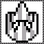

Beat Level 1 Mission 2

Conditions:
1. Go from the lobby to Level 1 Mission 2
2. Level 1 Mission 2 marked complete, and no other mission status' changed

Reset When:
1. Password menu opened
2. Player Dies (spawn back in lobby)

### Level 1 Mission 3

[Back to navigation](#achievements-navigation)

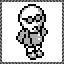

Beat Level 1 Mission 3

Conditions:
1. Go from the lobby to Level 1 Mission 3
2. Level 1 Mission 1 marked complete, and no other mission status' changed

Reset When:
1. Password menu opened
2. Player Dies (spawn back in lobby)

### Level 2 Mission 1

[Back to navigation](#achievements-navigation)

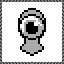

Beat Level 2 Mission 1

Conditions:
1. Go from the lobby to Level 2 Mission 1
2. Level 2 Mission 1 marked complete, and no other mission status' changed

Reset When:
1. Password menu opened
2. Player Dies (spawn back in lobby)

### Level 2 Mission 2

[Back to navigation](#achievements-navigation)

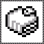

Beat Level 2 Mission 2

Conditions:
1. Go from the lobby to Level 2 Mission 2
2. Level 2 Mission 2 marked complete, and no other mission status' changed

Reset When:
1. Password menu opened
2. Player Dies (spawn back in lobby)

### Level 2 Mission 3

[Back to navigation](#achievements-navigation)

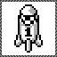

Beat Level 2 Mission 3

Conditions:
1. Go from the lobby to Level 2 Mission 3
2. Level 2 Mission 3 marked complete, and no other mission status' changed

Reset When:
1. Password menu opened
2. Player Dies (spawn back in lobby)

### Level 3 Mission 1

[Back to navigation](#achievements-navigation)

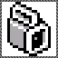

Beat Level 3 Mission 1

Conditions:
1. Go from the lobby to Level 3 Mission 1
2. Level 3 Mission 1 marked complete, and no other mission status' changed

Reset When:
1. Password menu opened
2. Player Dies (spawn back in lobby)

### Level 3 Mission 2

[Back to navigation](#achievements-navigation)

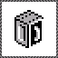

Beat Level 3 Mission 2

Conditions:
1. Go from the lobby to Level 3 Mission 2
2. Level 3 Mission 2 marked complete, and no other mission status' changed

Reset When:
1. Password menu opened
2. Player Dies (spawn back in lobby)

### Level 3 Mission 3

[Back to navigation](#achievements-navigation)

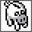

Beat Level 3 Mission 3

Conditions:
1. Go from the lobby to Level 3 Mission 3
2. Level 3 Mission 3 marked complete, and no other mission status' changed

Reset When:
1. Password menu opened
2. Player Dies (spawn back in lobby)

### Level 4 Mission 1

[Back to navigation](#achievements-navigation)

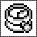

Beat Level 4 Mission 1

Conditions:
1. Go from the lobby to Level 4 Mission 1
2. Level 4 Mission 1 marked complete, and no other mission status' changed

Reset When:
1. Password menu opened
2. Player Dies (spawn back in lobby)

### Level 4 Mission 2

[Back to navigation](#achievements-navigation)

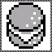

Beat Level 4 Mission 2

Conditions:
1. Go from the lobby to Level 4 Mission 2
2. Level 4 Mission 2 marked complete, and no other mission status' changed

Reset When:
1. Password menu opened
2. Player Dies (spawn back in lobby)

### Level 4 Mission 3

[Back to navigation](#achievements-navigation)

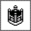

Beat Level 4 Mission 3

Conditions:
1. Go from the lobby to Level 4 Mission 3
2. Level 4 Mission 3 marked complete, and no other mission status' changed

Reset When:
1. Password menu opened
2. Player Dies (spawn back in lobby)

### Level 5 Mission 1

[Back to navigation](#achievements-navigation)

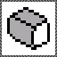

Beat Level 5 Mission 1

Conditions:
1. Go from the lobby to Level 5 Mission 1
2. Level 5 Mission 1 marked complete, and no other mission status' changed

Reset When:
1. Password menu opened
2. Player Dies (spawn back in lobby)

### Level 5 Mission 2

[Back to navigation](#achievements-navigation)

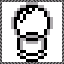

Beat Level 5 Mission 2

Conditions:
1. Go from the lobby to Level 5 Mission 2
2. Level 5 Mission 2 marked complete, and no other mission status' changed

Reset When:
1. Password menu opened
2. Player Dies (spawn back in lobby)

### Level 5 Mission 3

[Back to navigation](#achievements-navigation)

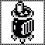

Beat Level 5 Mission 3

Conditions:
1. Go from the lobby to Level 5 Mission 3
2. Level 5 Mission 3 marked complete, and no other mission status' changed

Reset When:
1. Password menu opened
2. Player Dies (spawn back in lobby)

### Level 6 Mission 1

[Back to navigation](#achievements-navigation)

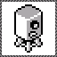

Beat Level 6 Mission 1

Conditions:
1. Go from the lobby to Level 6 Mission 1
2. Level 6 Mission 1 marked complete, and no other mission status' changed

Reset When:
1. Password menu opened
2. Player Dies (spawn back in lobby)

### Level 6 Mission 2

[Back to navigation](#achievements-navigation)

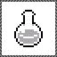

Beat Level 6 Mission 2

Conditions:
1. Go from the lobby to Level 6 Mission 2
2. Level 6 Mission 2 marked complete, and no other mission status' changed

Reset When:
1. Password menu opened
2. Player Dies (spawn back in lobby)

### Level 6 Mission 3

[Back to navigation](#achievements-navigation)

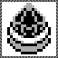

Beat Level 6 Mission 3

Conditions:
1. Go from the lobby to Level 6 Mission 3
2. Level 6 Mission 3 marked complete, and no other mission status' changed

Reset When:
1. Password menu opened
2. Player Dies (spawn back in lobby)

### Level 7 Mission 1

[Back to navigation](#achievements-navigation)

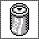

Beat Level 7 Mission 1

Conditions:
1. Go from the lobby to Level 7 Mission 1
2. Level 7 Mission 1 marked complete, and no other mission status' changed

Reset When:
1. Password menu opened
2. Player Dies (spawn back in lobby)

### Level 7 Mission 2

[Back to navigation](#achievements-navigation)

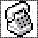

Beat Level 7 Mission 2

Conditions:
1. Go from the lobby to Level 7 Mission 2
2. Level 7 Mission 2 marked complete, and no other mission status' changed

Reset When:
1. Password menu opened
2. Player Dies (spawn back in lobby)

### Level 7 Mission 3

[Back to navigation](#achievements-navigation)

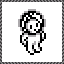

Beat Level 7 Mission 3

Conditions:
1. Go from the lobby to Level 7 Mission 3
2. Level 7 Mission 3 marked complete, and no other mission status' changed

Reset When:
1. Password menu opened
2. Player Dies (spawn back in lobby)

### Level 8 Mission 1

[Back to navigation](#achievements-navigation)

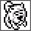

Beat Level 8 Mission 1

Conditions:
1. Go from the lobby to Level 8 Mission 1
2. Level 8 Mission 1 marked complete, and no other mission status' changed

Reset When:
1. Password menu opened
2. Player Dies (spawn back in lobby)

### Level 8 Mission 2

[Back to navigation](#achievements-navigation)

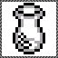

Beat Level 8 Mission 2

Conditions:
1. Go from the lobby to Level 8 Mission 2
2. Level 8 Mission 2 marked complete, and no other mission status' changed

Reset When:
1. Password menu opened
2. Player Dies (spawn back in lobby)

### Level 8 Mission 3

[Back to navigation](#achievements-navigation)

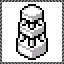

Beat Level 8 Mission 3

Conditions:
1. Go from the lobby to Level 8 Mission 3
2. Level 8 Mission 3 marked complete, and no other mission status' changed

Reset When:
1. Password menu opened
2. Player Dies (spawn back in lobby)

### Level 9 Mission 1

[Back to navigation](#achievements-navigation)

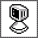

Beat Level 9 Mission 1

Conditions:
1. Go from the lobby to Level 9 Mission 1
2. Level 9 Mission 1 marked complete, and no other mission status' changed

Reset When:
1. Password menu opened
2. Player Dies (spawn back in lobby)

### Level 9 Mission 2

[Back to navigation](#achievements-navigation)

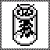

Beat Level 9 Mission 2

Conditions:
1. Go from the lobby to Level 9 Mission 2
2. Level 9 Mission 2 marked complete, and no other mission status' changed

Reset When:
1. Password menu opened
2. Player Dies (spawn back in lobby)

### Level 9 Mission 3

[Back to navigation](#achievements-navigation)

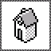

Beat Level 9 Mission 3

Conditions:
1. Go from the lobby to Level 9 Mission 3
2. Level 9 Mission 3 marked complete, and no other mission status' changed

Reset When:
1. Password menu opened
2. Player Dies (spawn back in lobby)

### Level 10 Mission 1

[Back to navigation](#achievements-navigation)

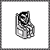

Beat Level 10 Mission 1

Conditions:
1. Go from the lobby to Level 10 Mission 1
2. Level 10 Mission 1 marked complete, and no other mission status' changed

Reset When:
1. Password menu opened
2. Player Dies (spawn back in lobby)

### Beat Game

[Back to navigation](#achievements-navigation)

Type: _**Win Condition**_

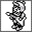

Conditions:
1. Start game with no levels completed
2. Buy level 1->2 pass
3. Buy level 2->3 pass
4. Buy level 3->4 pass
5. Buy level 4->5 pass
6. Buy level 5->6 pass
7. Buy level 6->7 pass
8. Buy level 7->8 pass
9. Buy level 8->9 pass
10. Buy level 9->10 pass
11. Buy level 10->FINAL pass

Reset When:
1. Password menu opened

## Rich Presence

Rich presence is available and will change depending on where you are in the game

1. if youre in the main lobby it will display
    * "Main Lobby"
    * Number of stars
    * level pass obtained
    * credits earned
2. if youre in a mission it will display
    * "Level X Mission Y"
    * current hearts
    * current stars
    * item A
    * item B

Scratch notes:

progression:
level X pass - 10pts * 9 = 90

win condition:
beat all levels in order no paswords - 50pts

normal achievements:
play pen - 1pt
beat lXmY - 3pts * 27 = 81
beat krond - 10pts

challenge (missable):
beat lXmY perfect - 5pts * 27 = 135pts
beat krond perfect - 15pts

67 achievements
382pts

V8Z?31XZ

TVX#-4BV

KL#KQZ11