# Design Doc for [Monster Max](https://retroachievements.org/game/4111)
## Table of Contents
1. [About](#about)
2. [Learnings](#learnings)
3. [Code Notes](#code-notes)
4. [Achievements](#achievements)
5. [Leaderboards](#leaderboards)
## About
<sub>[Back to Table of Contents](#table-of-contents)</sub>
- [Game Page](https://retroachievements.org/game/4111)
- [Forum Topic](https://retroachievements.org/forums/topic/27369)
- [Wikipedia](https://en.wikipedia.org/wiki/Monster_Max)
- [Walkthrough](https://gamefaqs.gamespot.com/gameboy/585809-monster-max/faqs/36096)
- [YouTube Video Playthrough](https://www.youtube.com/watch?v=p4EVqKSPrcs)
## Learnings
<sub>[Back to Table of Contents](#table-of-contents)</sub>

### Passwords

While playing through the game there is no save state for it, meaning if you play a few levels and want to quit and come back at a later time, the only way to "restore" your progress is by using the password system. The password system will place you at a specific point in the game. As far as i can tell passwords are characteristics of the player encoded. the values that are encoded seem to be a combination of: credits, levels completed, number of stars, and level pass obtained. Through some trial and error unfortunately I am unable to convert these values into passwords to try and thwart the password system abuse for achievements. There are no set passwords in the game, only the ability to enter 8 characters that can be any of the 32 characters supported in the system, making the game have thousands of passwords to chose from so hard coding password protection is not going to happen with no reliable way to generate passwords from the characteristics provided.

Playing with passwords seems to create a new password hash any time one of those characteristics changes, but when loading the game state in the game, it removes all lucky stars. You can never enter a password and get stars or specific items in your slots. the only thing that matters is lift pass level, missions completed flags, and credits. Also while playing with the password system it appears that there is some level of anti-cheat in the game. meaning you can't start the game with 9999 credits, you will need to enter a password hash that makes a valid game state. I do notice that some of the credits I manually calculate for what you can have at that point in the game differ from what passwords allow. This may be a buffer by the developers for some reason as I see no way to earn these extra points in the game. I will note what each levels max points can be with passwords in the Level details section below.

### Levels

There is 1 play pen, 9 levels with 3 missions each, and a final 10th level with one mission to complete the game. players can't move up to the next level unless the gather credits by completing missions on the floors they have access to. there is a way around completing levels by using passwords, either using one of the well known passwords on the internet to go to the end of the game and have all the lift passes, or getting a password that just gives you all the lift passes for free. Therefore level progression achievements need session and password protection to avoid players just going to the level prior with the max credits, and buying the next pass without playing the game since thats a valid state to get "free" points.

### Stars

Stars are accumulated by collecting them in the missions and displayed as a number in the top left of the screen. They allow you to take damage without losing a heart, its like a one hit protection and the more you collect the more hits you can take without losing hearts. Stars can only be obtained from missions, and are not given back if using a password to restore a game state.

### Detailed Mission Parameters

Totals calculation formula: `Reward + ((Given Hearts + In-Game Hearts + Gold Bullions) * Bonus Multiplier)`

Play Pen:
* Reward: 1 credit
* Given Hearts: 0
* Bonus Multiplier: 0 credits
* In-Game Hearts: 0
* Gold Bullions: 0
* Stars: 0
* Lightning: 0
* Power Spring: 1
* Power Ring: 0
* Map: 0
* Total: 1 + ((0 + 0 + 0) * 0) = 1 credits max

Level 1 Mission 1:
* Reward: 30 credits
* Given Hearts: 4
* Bonus Multiplier: 3 credits
* In-Game Hearts: 1
* Gold Bullions: 1
* Stars: 1
* Lightning: 1
* Power Spring: 0
* Power Ring: 0
* Map: 0
* Total: 30 + ((4 + 1 + 1) * 3) = 48 credits max

Level 1 Mission 2:
* Reward: 30 credits
* Given Hearts: 4
* Bonus Multiplier: 3 credits
* In-Game Hearts: 1
* Gold Bullions: 0
* Stars: 1
* Lightning: 0
* Power Spring: 1
* Power Ring: 0
* Map: 0
* Total: 30 + ((4 + 1 + 0) * 3) = 45 credits max

Level 1 Mission 3:
* Reward: 45 credits
* Given Hearts: 4
* Bonus Multiplier: 3 credits
* In-Game Hearts: 1
* Gold Bullions: 1
* Stars: 2
* Lightning: 2
* Power Spring: 0
* Power Ring: 1
* Map: 1
* Total: 45 + ((4 + 1 + 1) * 3) = 63 credits max

Level 1 Summary:
* Games Internal Max Credits With Passwords: 159
* Max credits: 1 + 48 + 45 + 63 = 157 credits
* Max stars: 4
* Lift Pass Cost: 70 credits
* Max credits after buying lift pass: 157 - 70 = 87 credits

Level 2 Mission 1:
* Reward: 45 credits
* Given Hearts: 4
* Bonus Multiplier: 7 credits
* In-Game Hearts: 1
* Gold Bullions: 0
* Stars: 2
* Lightning: 1
* Power Spring: 0
* Power Ring: 0
* Map: 1
* Total: 45 + ((4 + 1 + 0) * 7) = 80 credits max

Level 2 Mission 2:
* Reward: 40 credits
* Given Hearts: 4
* Bonus Multiplier: 7 credits
* In-Game Hearts: 1
* Gold Bullions: 1
* Stars: 3
* Lightning: 0
* Power Spring: 0
* Power Ring: 0
* Map: 0
* Total: 40 + ((4 + 1 + 1) * 7) = 82 credits max

Level 2 Mission 3:
* Reward: 65 credits
* Given Hearts: 4
* Bonus Multiplier: 7 credits
* In-Game Hearts: 1
* Gold Bullions: 0
* Stars: 0
* Lightning: 0
* Power Spring: 1
* Power Ring: 0
* Map: 0
* Total: 65 + ((4 + 1 + 0) * 7) = 100 credits max

Level 2 Summary:
* Games Internal Max Credits With Passwords: 354
* Max credits: 87 + 80 + 82 + 100 = 349 credits
* Max stars: 4 + 2 + 3 + 0 = 9
* Lift Pass Cost: 130 credits
* Max credits after buying lift pass: 349 - 130 = 219 credits

Level 3 Mission 1:
* Reward: 70 credits
* Given Hearts: 4
* Bonus Multiplier: 10 credits
* In-Game Hearts: 1
* Gold Bullions: 0
* Stars: 2
* Lightning: 1
* Power Spring: 0
* Power Ring: 0
* Map: 1
* Total: 70 + ((4 + 1 + 0) * 10) = 120 credits max

Level 3 Mission 2:
* Reward: 60 credits
* Given Hearts: 4
* Bonus Multiplier: 10 credits
* In-Game Hearts: 1
* Gold Bullions: 2
* Stars: 3
* Lightning: 0
* Power Spring: 0
* Power Ring: 0
* Map: 0
* Total: 60 + ((4 + 1 + 2) * 10) = 130 credits max

Level 3 Mission 3:
* Reward: 100 credits
* Given Hearts: 4
* Bonus Multiplier: 10 credits
* In-Game Hearts: 1
* Gold Bullions: 1
* Stars: 2
* Lightning: 1
* Power Spring: 1
* Power Ring: 0
* Map: 0
* Total: 100 + ((4 + 1 + 1) * 10) = 160 credits max

Level 3 Summary:
* Games Internal Max Credits With Passwords: 634
* Max credits: 219 + 120 + 130 + 160 = 629 credits
* Max stars: 9 + 2 + 3 + 2 = 16
* Lift Pass Cost: 200 credits
* Max credits after buying lift pass: 629 - 200 = 429 credits

Level 4 Mission 1:
* Reward: 100 credits
* Given Hearts: 4
* Bonus Multiplier: 15 credits
* In-Game Hearts: 1
* Gold Bullions: 1
* Stars: 0
* Lightning: 0
* Power Spring: 0
* Power Ring: 0
* Map: 0
* Total: 100 + ((4 + 1 + 1) * 15) = 190 credits max

Level 4 Mission 2:
* Reward: 100 credits
* Given Hearts: 4
* Bonus Multiplier: 15 credits
* In-Game Hearts: 1
* Gold Bullions: 1
* Stars: 1
* Lightning: 1
* Power Spring: 0
* Power Ring: 0
* Map: 0
* Total: 100 + ((4 + 1 + 1) * 15) = 190 credits max

Level 4 Mission 3:
* Reward: 150 credits
* Given Hearts: 3
* Bonus Multiplier: 15 credits
* In-Game Hearts: 1
* Gold Bullions: 1
* Stars: 1
* Lightning: 0
* Power Spring: 0
* Power Ring: 0
* Map: 1
* Total: 150 + ((3 + 1 + 1) * 15) = 225 credits max

Level 4 Summary:
* Games Internal Max Credits With Passwords: 1039
* Max credits: 429 + 190 + 190 + 225 = 1034 credits
* Max stars: 16 + 0 + 1 + 1 = 18
* Lift Pass Cost: 300 credits
* Max credits after buying lift pass: 1034 - 300 = 734 credits

Level 5 Mission 1:
* Reward: 150 credits
* Given Hearts: 4
* Bonus Multiplier: 20 credits
* In-Game Hearts: 1
* Gold Bullions: 2
* Stars: 1
* Lightning: 1
* Power Spring: 0
* Power Ring: 0
* Map: 0
* Total: 150 + ((4 + 1 + 2) * 20) = 290 credits max

Level 5 Mission 2:
* Reward: 200 credits
* Given Hearts: 3
* Bonus Multiplier: 20 credits
* In-Game Hearts: 1
* Gold Bullions: 0
* Stars: 1
* Lightning: 0
* Power Spring: 1
* Power Ring: 0
* Map: 0
* Total: 200 + ((3 + 1 + 0) * 20) = 280 credits max

Level 5 Mission 3:
* Reward: 300 credits
* Given Hearts: 3
* Bonus Multiplier: 20 credits
* In-Game Hearts: 1
* Gold Bullions: 0
* Stars: 1
* Lightning: 0
* Power Spring: 0
* Power Ring: 0
* Map: 0
* Total: 300 + ((3 + 1 + 0) * 20) = 380 credits max

Level 5 Summary:
* Games Internal Max Credits With Passwords: 1689
* Max credits: 734 + 290 + 280 + 380 = 1684 credits
* Max stars: 18 + 1 + 1 + 1 = 21
* Lift Pass Cost: 450 credits
* Max credits after buying lift pass: 1684 - 450 = 1234 credits

Level 6 Mission 1:
* Reward: 275 credits
* Given Hearts: 3
* Bonus Multiplier: 30 credits
* In-Game Hearts: 0
* Gold Bullions: 1
* Stars: 0
* Lightning: 5
* Power Spring: 0
* Power Ring: 0
* Map: 0
* Total: 275 + ((3 + 0 + 1) * 30) = 395 credits max

Level 6 Mission 2:
* Reward: 300 credits
* Given Hearts: 3
* Bonus Multiplier: 30 credits
* In-Game Hearts: 1
* Gold Bullions: 0
* Stars: 0
* Lightning: 3
* Power Spring: 0
* Power Ring: 1
* Map: 1
* Total: 300 + ((3 + 1 + 0) * 30) = 420 credits max

Level 6 Mission 3:
* Reward: 450 credits
* Given Hearts: 3
* Bonus Multiplier: 30 credits
* In-Game Hearts: 1
* Gold Bullions: 0
* Stars: 1
* Lightning: 0
* Power Spring: 1
* Power Ring: 0
* Map: 0
* Total: 450 + ((3 + 1 + 0) * 30) = 570 credits max

Level 6 Summary:
* Games Internal Max Credits With Passwords: 2654
* Max credits: 1234 + 395 + 420 + 570 = 2619 credits
* Max stars: 21 + 0 + 0 + 1 = 22
* Lift Pass Cost: 650 credits
* Max credits after buying lift pass: 2619 - 650 = 1969 credits

Level 7 Mission 1:
* Reward: 450 credits
* Given Hearts: 3
* Bonus Multiplier: 42 credits
* In-Game Hearts: 1
* Gold Bullions: 1
* Stars: 4
* Lightning: 0
* Power Spring: 0
* Power Ring: 0
* Map: 0
* Total: 450 + ((3 + 1 + 1) * 42) = 660 credits max

Level 7 Mission 2:
* Reward: 450 credits
* Given Hearts: 3
* Bonus Multiplier: 42 credits
* In-Game Hearts: 1
* Gold Bullions: 1
* Stars: 3
* Lightning: 1
* Power Spring: 0
* Power Ring: 0
* Map: 0
* Total: 450 + ((3 + 1 + 1) * 42) = 660 credits max

Level 7 Mission 3:
* Reward: 600 credits
* Given Hearts: 2
* Bonus Multiplier: 42 credits
* In-Game Hearts: 1
* Gold Bullions: 0
* Stars: 3
* Lightning: 0
* Power Spring: 1
* Power Ring: 1
* Map: 0
* Total: 600 + ((2 + 1 + 0) * 42) = 726 credits max

Level 7 Summary:
* Games Internal Max Credits With Passwords: 4049
* Max credits: 1969 + 660 + 660 + 726 = 4015
* Max stars: 22 + 4 + 3 + 3 = 32
* Lift Pass Cost: 1000 credits
* Max credits after buying lift pass: 4015 - 1000 = 3015 credits

Level 8 Mission 1:
* Reward: 650 credits
* Given Hearts: 3
* Bonus Multiplier: 60 credits
* In-Game Hearts: 1
* Gold Bullions: 0
* Stars: 1
* Lightning: 16
* Power Spring: 0
* Power Ring: 0
* Map: 0
* Total: 650 + ((3 + 1 + 0) * 60) = 890 credits max

Level 8 Mission 2:
* Reward: 650 credits
* Given Hearts: 2
* Bonus Multiplier: 60 credits
* In-Game Hearts: 1
* Gold Bullions: 0
* Stars: 3
* Lightning: 1
* Power Spring: 0
* Power Ring: 0
* Map: 0
* Total: 650 + ((2 + 1 + 0) * 60) = 830 credits max

Level 8 Mission 3:
* Reward: 850 credits
* Given Hearts: 2
* Bonus Multiplier: 60 credits
* In-Game Hearts: 1
* Gold Bullions: 1
* Stars: 5
* Lightning: 0
* Power Spring: 0
* Power Ring: 0
* Map: 0
* Total: 850 + ((2 + 1 + 1) * 60) = 1090 credits max

Level 8 Summary:
* Games Internal Max Credits With Passwords: 5859
* Max credits: 3015 + 890 + 830 + 1090 = 5825
* Max stars: 32 + 1 + 3 + 5 = 41
* Lift Pass Cost: 1500 credits
* Max credits after buying lift pass: 5825 - 1500 = 4325 credits

Level 9 Mission 1:
* Reward: 900 credits
* Given Hearts: 2
* Bonus Multiplier: 90 credits
* In-Game Hearts: 1
* Gold Bullions: 0
* Stars: 5
* Lightning: 0
* Power Spring: 0
* Power Ring: 0
* Map: 0
* Total: 900 + ((2 + 1 + 0) * 90) = 1170 credits max

Level 9 Mission 2:
* Reward: 800 credits
* Given Hearts: 2
* Bonus Multiplier: 90 credits
* In-Game Hearts: 1
* Gold Bullions: 2
* Stars: 3
* Lightning: 1
* Power Spring: 0
* Power Ring: 1
* Map: 0
* Total: 800 + ((2 + 1 + 2) * 90) = 1250 credits max

Level 9 Mission 3:
* Reward: 1100 credits
* Given Hearts: 2
* Bonus Multiplier: 90 credits
* In-Game Hearts: 1
* Gold Bullions: 0
* Stars: 1
* Lightning: 0
* Power Spring: 0
* Power Ring: 0
* Map: 1
* Total: 1100 + ((2 + 1 + 0) * 90) = 1370 credits max

Level 9 Summary:
* Games Internal Max Credits With Passwords: 8149
* Max credits: 4325 + 1170 + 1250 + 1370 = 8115
* Max stars: 41 + 5 + 3 + 1 = 50
* Lift Pass Cost: 2500 credits
* Max credits after buying lift pass: 8115 - 2500 = 5615 credits

Level 10 Mission 1:
* Reward: 3500 credits
* Given Hearts: 3
* Bonus Multiplier: 120 credits
* In-Game Hearts: 4
* Gold Bullions: 0
* Stars: 1
* Lightning: 2
* Power Spring: 1
* Power Ring: 1
* Map: 0
* Total: 3500 + ((3 + 4 + 0) * 120) = 4340 credits max

Level 10 Summary:
* Games Internal Max Credits With Passwords: 9998
* Max credits: 5615 + 4340 = 9955
* Max stars: 50 + 4 = 54

## Code Notes
<sub>[Back to Table of Contents](#table-of-contents)</sub>
### Code Notes Navigation
1. [Code Note 0x000000](#code-note-0x000000)
2. [Code Note 0x00c006](#code-note-0x00c006)
3. [Code Note 0x00c009](#code-note-0x00c009)
4. [Code Note 0x00cfbf](#code-note-0x00cfbf)
5. [Code Note 0x00d002](#code-note-0x00d002)
6. [Code Note 0x00d003](#code-note-0x00d003)
7. [Code Note 0x00d004](#code-note-0x00d004)
8. [Code Note 0x00d005](#code-note-0x00d005)
9. [Code Note 0x00d008](#code-note-0x00d008)
10. [Code Note 0x00d00a](#code-note-0x00d00a)
11. [Code Note 0x00d08a](#code-note-0x00d08a)
12. [Code Note 0x00d0fd](#code-note-0x00d0fd)
13. [Code Note 0x00d0fe](#code-note-0x00d0fe)
14. [Code Note 0x00d10b](#code-note-0x00d10b)
15. [Code Note 0x00d120](#code-note-0x00d120)
16. [Code Note 0x00d122](#code-note-0x00d122)
17. [Code Note 0x00d123](#code-note-0x00d123)
18. [Code Note 0x00d124](#code-note-0x00d124)
19. [Code Note 0x00d125](#code-note-0x00d125)
20. [Code Note 0x00d126](#code-note-0x00d126)
21. [Code Note 0x00d127](#code-note-0x00d127)
22. [Code Note 0x00d128](#code-note-0x00d128)
23. [Code Note 0x00d129](#code-note-0x00d129)
24. [Code Note 0x00d12d](#code-note-0x00d12d)
25. [Code Note 0x00d12e](#code-note-0x00d12e)
26. [Code Note 0x00d190](#code-note-0x00d190)
27. [Code Note 0x00d191](#code-note-0x00d191)
28. [Code Note 0x00d192](#code-note-0x00d192)
29. [Code Note 0x00d193](#code-note-0x00d193)
30. [Code Note 0x00d194](#code-note-0x00d194)
31. [Code Note 0x00d195](#code-note-0x00d195)
32. [Code Note 0x00d196](#code-note-0x00d196)
33. [Code Note 0x00d197](#code-note-0x00d197)
34. [Code Note 0x00d198](#code-note-0x00d198)
35. [Code Note 0x00d199](#code-note-0x00d199)
36. [Code Note 0x00d19a](#code-note-0x00d19a)
37. [Code Note 0x00d19b](#code-note-0x00d19b)
38. [Code Note 0x00d19c](#code-note-0x00d19c)
39. [Code Note 0x00d19d](#code-note-0x00d19d)
40. [Code Note 0x00d3e2](#code-note-0x00d3e2)
41. [Code Note 0x00d3e3](#code-note-0x00d3e3)
42. [Code Note 0x00d3e5](#code-note-0x00d3e5)
43. [Code Note 0x00d3e6](#code-note-0x00d3e6)
44. [Code Note 0x00d3e7](#code-note-0x00d3e7)
45. [Code Note 0x00d3e9](#code-note-0x00d3e9)
46. [Code Note 0x00d3ea](#code-note-0x00d3ea)
47. [Code Note 0x00d3ef](#code-note-0x00d3ef)
48. [Code Note 0x00d3f0](#code-note-0x00d3f0)
49. [Code Note 0x00d3f1](#code-note-0x00d3f1)
50. [Code Note 0x00d3f2](#code-note-0x00d3f2)
51. [Code Note 0x00d3f3](#code-note-0x00d3f3)
52. [Code Note 0x00d3f4](#code-note-0x00d3f4)
53. [Code Note 0x00d3f5](#code-note-0x00d3f5)
54. [Code Note 0x00d3f6](#code-note-0x00d3f6)
55. [Code Note 0x00d3f7](#code-note-0x00d3f7)
56. [Code Note 0x00d402](#code-note-0x00d402)
### Code Note 0x000000
<sub>[Back to navigation](#code-notes-navigation)</sub><br>
<br>Author: [joshraphael](https://retroachievements.org/user/joshraphael)<br>
```txt
RAScript: https://github.com/joshraphael/ra4111/blob/main/4111.rascript
```
### Code Note 0x00c006
<sub>[Back to navigation](#code-notes-navigation)</sub><br>
<br>Author: [joshraphael](https://retroachievements.org/user/joshraphael)<br>
```txt
[16-bit] Start Menu

the 0x3836 value is a special value swapped in for showing the start menu map

0x3836 = Open
```
### Code Note 0x00c009
<sub>[Back to navigation](#code-notes-navigation)</sub><br>
<br>Author: [joshraphael](https://retroachievements.org/user/joshraphael)<br>
```txt
[8-bit] Select Menu

Upper4
0x0 = Open
0x1 = Closed

Lower4
N/A
```
### Code Note 0x00cfbf
<sub>[Back to navigation](#code-notes-navigation)</sub><br>
<br>Author: [joshraphael](https://retroachievements.org/user/joshraphael)<br>
```txt
[8-bit] Current Mission

0x00 = Main Lobby
0x01 = Play Pen
0x02 = Level 1 Mission 1
0x03 = Level 1 Mission 2
0x04 = Level 1 Mission 3
0x05 = Level 2 Mission 1
0x06 = Level 2 Mission 2
0x07 = Level 2 Mission 3
0x08 = Level 3 Mission 1
0x09 = Level 3 Mission 2
0x0a = Level 3 Mission 3
0x0b = Level 4 Mission 1
0x0c = Level 4 Mission 2
0x0d = Level 4 Mission 3
0x0e = Level 5 Mission 1
0x0f = Level 5 Mission 2
0x10 = Level 5 Mission 3
0x11 = Level 6 Mission 1
0x12 = Level 6 Mission 2
0x13 = Level 6 Mission 3
0x14 = Level 7 Mission 1
0x15 = Level 7 Mission 2
0x16 = Level 7 Mission 3
0x17 = Level 8 Mission 1
0x18 = Level 8 Mission 2
0x19 = Level 8 Mission 3
0x1a = Level 9 Mission 1
0x1b = Level 9 Mission 2
0x1c = Level 9 Mission 3
0x1d = Final Mission
0x1e = Title Screen
0x1f = Final Concert Scene
```
### Code Note 0x00d002
<sub>[Back to navigation](#code-notes-navigation)</sub><br>
<br>Author: [joshraphael](https://retroachievements.org/user/joshraphael)<br>
```txt
[8-bit] Mission Final Item Flags Group 1

Does not appear to be an order of item type. These mark the final item collected or destroyed that open the door to the end of the mission.

0 = not obtained
1 = obtained

Bit0 = N/A
Bit1 = N/A
Bit2 = N/A
Bit3 = N/A
Bit4 = N/A
Bit5 = N/A
Bit6 = N/A
Bit7 = Play Pen, 4-3
```
### Code Note 0x00d003
<sub>[Back to navigation](#code-notes-navigation)</sub><br>
<br>Author: [joshraphael](https://retroachievements.org/user/joshraphael)<br>
```txt
[8-bit] Mission Final Item Flags Group 2

Does not appear to be an order of item type. These mark the final item collected or destroyed that open the door to the end of the mission.

0 = not obtained
1 = obtained

Bit0 = N/A
Bit1 = 5-1
Bit2 = N/A
Bit3 = 7-3
Bit4 = N/A
Bit5 = N/A
Bit6 = N/A
Bit7 = 3-2, 9-3
```
### Code Note 0x00d004
<sub>[Back to navigation](#code-notes-navigation)</sub><br>
<br>Author: [joshraphael](https://retroachievements.org/user/joshraphael)<br>
```txt
[8-bit] Mission Final Item Flags Group 3

Does not appear to be an order of item type. These mark the final item collected or destroyed that open the door to the end of the mission.

0 = not obtained
1 = obtained

Bit0 = 2-2, 4-2, 5-2, 6-3, 8-2, 9-1, 9-2
Bit1 = 1-1, 1-2, 3-3, 4-1, 5-3, 7-1, 8-1, 8-3
Bit2 = 1-3, 2-3, 3-1, 7-2
Bit3 = N/A
Bit4 = 2-1
Bit5 = N/A
Bit6 = N/A
Bit7 = N/A
```
### Code Note 0x00d005
<sub>[Back to navigation](#code-notes-navigation)</sub><br>
<br>Author: [joshraphael](https://retroachievements.org/user/joshraphael)<br>
```txt
[8-bit] Mission Final Item Flags Group 4

Does not appear to be an order of item type. These mark the final item collected or destroyed that open the door to the end of the mission.

0 = not obtained
1 = obtained

Bit0 = N/A
Bit1 = N/A
Bit2 = N/A
Bit3 = N/A
Bit4 = 6-1
Bit5 = 6-2
Bit6 = N/A
Bit7 = N/A
```
### Code Note 0x00d008
<sub>[Back to navigation](#code-notes-navigation)</sub><br>
<br>Author: [joshraphael](https://retroachievements.org/user/joshraphael)<br>
```txt
[8-bit] Mission Final Item Flags Group 5

Does not appear to be an order of item type. These mark the final item collected or destroyed that open the door to the end of the mission.

0 = not obtained
1 = obtained

Bit0 = N/A
Bit1 = N/A
Bit2 = N/A
Bit3 = N/A
Bit4 = N/A
Bit5 = 10-1
Bit6 = N/A
Bit7 = N/A
```
### Code Note 0x00d00a
<sub>[Back to navigation](#code-notes-navigation)</sub><br>
<br>Author: [joshraphael](https://retroachievements.org/user/joshraphael)<br>
```txt
[32-bit] Missions Unlocked Flags

0 = not completed
1 = completed

Bit0 = Play Pen
Bit1 = Level 1 Mission 1
Bit2 = Level 1 Mission 2
Bit3 = Level 1 Mission 3
Bit4 = Level 2 Mission 1
Bit5 = Level 2 Mission 2
Bit6 = Level 2 Mission 3
Bit7 = Level 3 Mission 1
Bit8 = Level 3 Mission 2
Bit9 = Level 3 Mission 3
Bit10 = Level 4 Mission 1
Bit11 = Level 4 Mission 2
Bit12 = Level 4 Mission 3
Bit13 = Level 5 Mission 1
Bit14 = Level 5 Mission 2
Bit15 = Level 5 Mission 3
Bit16 = Level 6 Mission 1
Bit17 = Level 6 Mission 2
Bit18 = Level 6 Mission 3
Bit19 = Level 7 Mission 1
Bit20 = Level 7 Mission 2
Bit21 = Level 7 Mission 3
Bit22 = Level 8 Mission 1
Bit23 = Level 8 Mission 2
Bit24 = Level 8 Mission 3
Bit25 = Level 9 Mission 1
Bit26 = Level 9 Mission 2
Bit27 = Level 9 Mission 3
Bit28 = Level 10 Mission 
Bit29 = Unused
Bit30 = Unused
Bit31 = Unused
```
### Code Note 0x00d08a
<sub>[Back to navigation](#code-notes-navigation)</sub><br>
<br>Author: [joshraphael](https://retroachievements.org/user/joshraphael)<br>
```txt
[8-bit] Mission Key Item Flags

Only used for the final mission where you collect four key items that are not power ups in order for the final room to allow you to cross the bridge and defeat King Krond.

0 = not obtained
1 = obtained

Bit0 = item 1
Bit1 = item 2
Bit2 = item 3
Bit3 = item 4
Bit4 = N/A
Bit5 = N/A
Bit6 = N/A
Bit7 = N/A
```
### Code Note 0x00d0fd
<sub>[Back to navigation](#code-notes-navigation)</sub><br>
<br>Author: [joshraphael](https://retroachievements.org/user/joshraphael)<br>
```txt
[8-bit] A Button Item

0x00 = boots
0x01 = bag
0x02 = bag (occupied)
0x03 = sword
0x04 = gun level 2
0x05 = gun level 1
0x06 = duck
0x07 = force field
0x08 = bomb
```
### Code Note 0x00d0fe
<sub>[Back to navigation](#code-notes-navigation)</sub><br>
<br>Author: [joshraphael](https://retroachievements.org/user/joshraphael)<br>
```txt
[8-bit] B Button Item

0x00 = boots
0x01 = bag
0x02 = bag (occupied)
0x03 = sword
0x04 = gun level 2
0x05 = gun level 1
0x06 = duck
0x07 = force field
0x08 = bomb
```
### Code Note 0x00d10b
<sub>[Back to navigation](#code-notes-navigation)</sub><br>
<br>Author: [joshraphael](https://retroachievements.org/user/joshraphael)<br>
```txt
[8-bit] Bag Contents

0x74 = empty
0xb8 = box
```
### Code Note 0x00d120
<sub>[Back to navigation](#code-notes-navigation)</sub><br>
<br>Author: [joshraphael](https://retroachievements.org/user/joshraphael)<br>
```txt
[8-bit] Lucky Stars

can hold 255 but can only display 9

0x00 = 0
0x01 = 1
0x02 = 2
0x03 = 3
0x04 = 4
0x05 = 5
0x06 = 6
0x07 = 7
0x08 = 8
0x09 = 9
...
0xff = 255
```
### Code Note 0x00d122
<sub>[Back to navigation](#code-notes-navigation)</sub><br>
<br>Author: [joshraphael](https://retroachievements.org/user/joshraphael)<br>
```txt
[8-bit] Health

can hold 254 but can only display 5

0xff = Dead
0x00 = 0 hearts
0x01 = 1 hearts
0x02 = 2 hearts
0x03 = 3 hearts
0x04 = 4 hearts
0x05 = 5 hearts
...
0xfe = 254
```
### Code Note 0x00d123
<sub>[Back to navigation](#code-notes-navigation)</sub><br>
<br>Author: [joshraphael](https://retroachievements.org/user/joshraphael)<br>
```txt
[8-bit] Speed Boost Left

can hold 255, each lightning adds 32 (0x20) speed tile steps

0x00 = 0 tiles
0x01 = 1 tiles
0x02 = 2 tiles
...
0x20 = 32 tiles
...
0xff = 255 tiles
```
### Code Note 0x00d124
<sub>[Back to navigation](#code-notes-navigation)</sub><br>
<br>Author: [joshraphael](https://retroachievements.org/user/joshraphael)<br>
```txt
[8-bit] Power Ring Time Remaining

can hold 255, each power ring adds 32 (0x20) seconds

0x00 = 0 seconds
0x01 = 1 seconds
0x02 = 2 seconds
0x03 = 3 seconds
0x04 = 4 seconds
0x05 = 5 seconds
0x06 = 6 seconds
0x07 = 7 seconds
0x08 = 8 seconds
0x09 = 9 seconds
0x0a = 10 seconds
0x0b = 11 seconds
0x0c = 12 seconds
0x0d = 13 seconds
0x0e = 14 seconds
0x0f = 15 seconds
0x10 = 16 seconds
0x11 = 17 seconds
0x12 = 18 seconds
0x13 = 19 seconds
0x14 = 20 seconds
0x15 = 21 seconds
0x16 = 22 seconds
0x17 = 23 seconds
0x18 = 24 seconds
0x19 = 25 seconds
0x1a = 26 seconds
0x1b = 27 seconds
0x1c = 28 seconds
0x1f = 29 seconds
0x1e = 30 seconds
0x1f = 31 seconds
0x20 = 32 seconds
...
0xff = 255 seconds
```
### Code Note 0x00d125
<sub>[Back to navigation](#code-notes-navigation)</sub><br>
<br>Author: [joshraphael](https://retroachievements.org/user/joshraphael)<br>
```txt
[8-bit] Power Spring Jumps Remaining

can hold 255, each power spring adds 10 (0x0a) jumps

0x00 = 0 jumps
0x01 = 1 jumps
0x02 = 2 jumps
0x03 = 3 jumps
0x04 = 4 jumps
0x05 = 5 jumps
0x06 = 6 jumps
0x07 = 7 jumps
0x08 = 8 jumps
0x09 = 9 jumps
0x0a = 10 jumps
...
0xff = 255 jumps
```
### Code Note 0x00d126
<sub>[Back to navigation](#code-notes-navigation)</sub><br>
<br>Author: [joshraphael](https://retroachievements.org/user/joshraphael)<br>
```txt
[8-bit] Player Direction Facing

0x01 = NE
0x02 = SW
0x04 = NW
0x08 = SE
```
### Code Note 0x00d127
<sub>[Back to navigation](#code-notes-navigation)</sub><br>
<br>Author: [joshraphael](https://retroachievements.org/user/joshraphael)<br>
```txt
[8-bit] Player Direction Button Being Pressed

0x00 = None
0x01 = NE
0x02 = SW
0x04 = NW
0x08 = SE
```
### Code Note 0x00d128
<sub>[Back to navigation](#code-notes-navigation)</sub><br>
<br>Author: [joshraphael](https://retroachievements.org/user/joshraphael)<br>
```txt
[8-bit] Lift Pass Level

0x00 = level 1
0x01 = level 2
0x02 = level 3
0x03 = level 4
0x04 = level 5
0x05 = level 6
0x06 = level 7
0x07 = level 8
0x08 = level 9
0x09 = level 10
```
### Code Note 0x00d129
<sub>[Back to navigation](#code-notes-navigation)</sub><br>
<br>Author: [joshraphael](https://retroachievements.org/user/joshraphael)<br>
```txt
[16-bit] Credits

0x0000 = 0
0x0001 = 1
0x0002 = 2
...
0xffff = 65535
```
### Code Note 0x00d12d
<sub>[Back to navigation](#code-notes-navigation)</sub><br>
<br>Author: [joshraphael](https://retroachievements.org/user/joshraphael)<br>
```txt
[8-bit] Response Setting

0x00 = High
0x01 = Low
```
### Code Note 0x00d12e
<sub>[Back to navigation](#code-notes-navigation)</sub><br>
<br>Author: [joshraphael](https://retroachievements.org/user/joshraphael)<br>
```txt
[8-bit] Idle Animation Timer

Only works if player is facing southwest or southeast

0x00 = not idle
0x01 = not idle
0x02 = not idle
...
0xfd = not idle
0xfe = not idle
0xff = idle
```
### Code Note 0x00d190
<sub>[Back to navigation](#code-notes-navigation)</sub><br>
<br>Author: [joshraphael](https://retroachievements.org/user/joshraphael)<br>
```txt
[8-bit] Start Menu Map Group 1 Flags

0 = room not visited
1 = room visited

Bit0 = room 1
Bit1 = room 2
Bit2 = room 3
Bit3 = room 4
Bit4 = room 5
Bit5 = room 6
Bit6 = room 7
Bit7 = room 8
```
### Code Note 0x00d191
<sub>[Back to navigation](#code-notes-navigation)</sub><br>
<br>Author: [joshraphael](https://retroachievements.org/user/joshraphael)<br>
```txt
[8-bit] Start Menu Map Group 2 Flags

0 = room not visited
1 = room visited

Bit0 = room 9
Bit1 = room 10
Bit2 = room 11
Bit3 = room 12
Bit4 = room 13
Bit5 = room 14
Bit6 = room 15
Bit7 = room 16
```
### Code Note 0x00d192
<sub>[Back to navigation](#code-notes-navigation)</sub><br>
<br>Author: [joshraphael](https://retroachievements.org/user/joshraphael)<br>
```txt
[8-bit] Start Menu Map Group 3 Flags

0 = room not visited
1 = room visited

Bit0 = room 17
Bit1 = room 18
Bit2 = room 19
Bit3 = room 20
Bit4 = room 21
Bit5 = room 22
Bit6 = room 23
Bit7 = room 24
```
### Code Note 0x00d193
<sub>[Back to navigation](#code-notes-navigation)</sub><br>
<br>Author: [joshraphael](https://retroachievements.org/user/joshraphael)<br>
```txt
[8-bit] Start Menu Map Group 4 Flags

0 = room not visited
1 = room visited

Bit0 = room 25
Bit1 = room 26
Bit2 = room 27
Bit3 = room 28
Bit4 = room 29
Bit5 = room 30
Bit6 = room 31
Bit7 = room 32
```
### Code Note 0x00d194
<sub>[Back to navigation](#code-notes-navigation)</sub><br>
<br>Author: [joshraphael](https://retroachievements.org/user/joshraphael)<br>
```txt
[8-bit] Start Menu Map Group 5 Flags

0 = room not visited
1 = room visited

Bit0 = room 33
Bit1 = room 34
Bit2 = room 35
Bit3 = room 36
Bit4 = room 37
Bit5 = room 38
Bit6 = room 39
Bit7 = room 40
```
### Code Note 0x00d195
<sub>[Back to navigation](#code-notes-navigation)</sub><br>
<br>Author: [joshraphael](https://retroachievements.org/user/joshraphael)<br>
```txt
[8-bit] Start Menu Map Group 6 Flags

0 = room not visited
1 = room visited

Bit0 = room 41
Bit1 = room 42
Bit2 = room 43
Bit3 = room 44
Bit4 = room 45
Bit5 = room 46
Bit6 = room 47
Bit7 = room 48
```
### Code Note 0x00d196
<sub>[Back to navigation](#code-notes-navigation)</sub><br>
<br>Author: [joshraphael](https://retroachievements.org/user/joshraphael)<br>
```txt
[8-bit] Start Menu Map Group 7 Flags

0 = room not visited
1 = room visited

Bit0 = room 49
Bit1 = room 50
Bit2 = room 51
Bit3 = room 52
Bit4 = room 53
Bit5 = room 54
Bit6 = room 55
Bit7 = room 56
```
### Code Note 0x00d197
<sub>[Back to navigation](#code-notes-navigation)</sub><br>
<br>Author: [joshraphael](https://retroachievements.org/user/joshraphael)<br>
```txt
[8-bit] Rooms Available In Mission Group 1

These act as a count of rooms in the mission, the start menu map group flag address's (0xd190 - 0xd196) should build up to the shape of available rooms in the mission (0xd197 - 0xd19d)

0 = room not available
1 = room available

Bit0 = room 1
Bit1 = room 2
Bit2 = room 3
Bit3 = room 4
Bit4 = room 5
Bit5 = room 6
Bit6 = room 7
Bit7 = room 8
```
### Code Note 0x00d198
<sub>[Back to navigation](#code-notes-navigation)</sub><br>
<br>Author: [joshraphael](https://retroachievements.org/user/joshraphael)<br>
```txt
[8-bit] Rooms Available In Mission Group 2

These act as a count of rooms in the mission, the start menu map group flag address's (0xd190 - 0xd196) should build up to the shape of available rooms in the mission (0xd197 - 0xd19d)

0 = room not available
1 = room available

Bit0 = room 9
Bit1 = room 10
Bit2 = room 11
Bit3 = room 12
Bit4 = room 13
Bit5 = room 14
Bit6 = room 15
Bit7 = room 16
```
### Code Note 0x00d199
<sub>[Back to navigation](#code-notes-navigation)</sub><br>
<br>Author: [joshraphael](https://retroachievements.org/user/joshraphael)<br>
```txt
[8-bit] Rooms Available In Mission Group 3

These act as a count of rooms in the mission, the start menu map group flag address's (0xd190 - 0xd196) should build up to the shape of available rooms in the mission (0xd197 - 0xd19d)

0 = room not available
1 = room available

Bit0 = room 17
Bit1 = room 18
Bit2 = room 19
Bit3 = room 20
Bit4 = room 21
Bit5 = room 22
Bit6 = room 23
Bit7 = room 24
```
### Code Note 0x00d19a
<sub>[Back to navigation](#code-notes-navigation)</sub><br>
<br>Author: [joshraphael](https://retroachievements.org/user/joshraphael)<br>
```txt
[8-bit] Rooms Available In Mission Group 4

These act as a count of rooms in the mission, the start menu map group flag address's (0xd190 - 0xd196) should build up to the shape of available rooms in the mission (0xd197 - 0xd19d)

0 = room not available
1 = room available

Bit0 = room 25
Bit1 = room 26
Bit2 = room 27
Bit3 = room 28
Bit4 = room 29
Bit5 = room 30
Bit6 = room 31
Bit7 = room 32
```
### Code Note 0x00d19b
<sub>[Back to navigation](#code-notes-navigation)</sub><br>
<br>Author: [joshraphael](https://retroachievements.org/user/joshraphael)<br>
```txt
[8-bit] Rooms Available In Mission Group 5

These act as a count of rooms in the mission, the start menu map group flag address's (0xd190 - 0xd196) should build up to the shape of available rooms in the mission (0xd197 - 0xd19d)

0 = room not available
1 = room available

Bit0 = room 33
Bit1 = room 34
Bit2 = room 35
Bit3 = room 36
Bit4 = room 37
Bit5 = room 38
Bit6 = room 39
Bit7 = room 40
```
### Code Note 0x00d19c
<sub>[Back to navigation](#code-notes-navigation)</sub><br>
<br>Author: [joshraphael](https://retroachievements.org/user/joshraphael)<br>
```txt
[8-bit] Rooms Available In Mission Group 6

These act as a count of rooms in the mission, the start menu map group flag address's (0xd190 - 0xd196) should build up to the shape of available rooms in the mission (0xd197 - 0xd19d)

0 = room not available
1 = room available

Bit0 = room 41
Bit1 = room 42
Bit2 = room 43
Bit3 = room 44
Bit4 = room 45
Bit5 = room 46
Bit6 = room 47
Bit7 = room 48
```
### Code Note 0x00d19d
<sub>[Back to navigation](#code-notes-navigation)</sub><br>
<br>Author: [joshraphael](https://retroachievements.org/user/joshraphael)<br>
```txt
[8-bit] Rooms Available In Mission Group 7

These act as a count of rooms in the mission, the start menu map group flag address's (0xd190 - 0xd196) should build up to the shape of available rooms in the mission (0xd197 - 0xd19d)

0 = room not available
1 = room available

Bit0 = room 49
Bit1 = room 50
Bit2 = room 51
Bit3 = room 52
Bit4 = room 53
Bit5 = room 54
Bit6 = room 55
Bit7 = room 56
```
### Code Note 0x00d3e2
<sub>[Back to navigation](#code-notes-navigation)</sub><br>
<br>Author: [joshraphael](https://retroachievements.org/user/joshraphael)<br>
```txt
[8-bit] Password Menu Letter Selector X

X coordinate of cursor in password letter selection menu

0x00 = 0
0x01 = 1
0x02 = 2
0x03 = 3
0x04 = 4
0x05 = 5
0x06 = 6
0x07 = 7
```
### Code Note 0x00d3e3
<sub>[Back to navigation](#code-notes-navigation)</sub><br>
<br>Author: [joshraphael](https://retroachievements.org/user/joshraphael)<br>
```txt
[8-bit] Password Menu Letter Selector Y

Y coordinate of cursor in password letter selection menu

0x00 = 0
0x01 = 1
0x02 = 2
0x03 = 3
```
### Code Note 0x00d3e5
<sub>[Back to navigation](#code-notes-navigation)</sub><br>
<br>Author: [joshraphael](https://retroachievements.org/user/joshraphael)<br>
```txt
[8-bit] Select Menu Option

0x00 = information (default, resets on open)
0x01 = enter password
0x02 = control pad
0x03 = response
```
### Code Note 0x00d3e6
<sub>[Back to navigation](#code-notes-navigation)</sub><br>
<br>Author: [joshraphael](https://retroachievements.org/user/joshraphael)<br>
```txt
[8-bit] Language

0x00 = ENGLISH
0x03 = FRANCAIS
0x06 = NEDERLANDS
0x09 = ITALIANO
0x0c = ESPANOL
0x0f = DEUTCH
```
### Code Note 0x00d3e7
<sub>[Back to navigation](#code-notes-navigation)</sub><br>
<br>Author: [joshraphael](https://retroachievements.org/user/joshraphael)<br>
```txt
[8-bit] Control Pad Setting

0x10 = A
0x00 = B
```
### Code Note 0x00d3e9
<sub>[Back to navigation](#code-notes-navigation)</sub><br>
<br>Author: [joshraphael](https://retroachievements.org/user/joshraphael)<br>
```txt
[8-bit] Information Menu Selector X

X coordinate of cursor in the information selection menu

0x00 = 0
0x03 = 2
0x06 = 3
0x09 = 4
0x0c = 5
0x0f = 6
0x12 = 7
```
### Code Note 0x00d3ea
<sub>[Back to navigation](#code-notes-navigation)</sub><br>
<br>Author: [joshraphael](https://retroachievements.org/user/joshraphael)<br>
```txt
[8-bit] Information Menu Selector Y

Y coordinate of cursor in the information selection menu

0x04 = 1
0x08 = 2
```
### Code Note 0x00d3ef
<sub>[Back to navigation](#code-notes-navigation)</sub><br>
<br>Author: [joshraphael](https://retroachievements.org/user/joshraphael)<br>
```txt
[8-bit] Password Length

0x00 = 0
0x01 = 1
0x02 = 2
0x03 = 3
0x04 = 4
0x05 = 5
0x06 = 6
0x07 = 7
0x08 = 8
```
### Code Note 0x00d3f0
<sub>[Back to navigation](#code-notes-navigation)</sub><br>
<br>Author: [joshraphael](https://retroachievements.org/user/joshraphael)<br>
```txt
[8-bit] Password Character 1

0x00 = 1
0x01 = 2
0x02 = 3
0x03 = 4
0x04 = 5
0x05 = 6
0x06 = 7
0x07 = 8
0x08 = 9
0x09 = B
0x0a = D
0x0b = G
0x0c = H
0x0d = J
0x0e = K
0x0f = L
0x10 = M
0x11 = N
0x12 = P
0x13 = Q
0x14 = R
0x15 = T
0x16 = V
0x17 = W
0x18 = X
0x19 = Y
0x1a = Z
0x1b = #
0x1c = !
0x1d = *
0x1e = -
0x1f = ?
0xff = <blank>
```
### Code Note 0x00d3f1
<sub>[Back to navigation](#code-notes-navigation)</sub><br>
<br>Author: [joshraphael](https://retroachievements.org/user/joshraphael)<br>
```txt
[8-bit] Password Character 2

(see 0xd3f0)
```
### Code Note 0x00d3f2
<sub>[Back to navigation](#code-notes-navigation)</sub><br>
<br>Author: [joshraphael](https://retroachievements.org/user/joshraphael)<br>
```txt
[8-bit] Password Character 3

(see 0xd3f0)
```
### Code Note 0x00d3f3
<sub>[Back to navigation](#code-notes-navigation)</sub><br>
<br>Author: [joshraphael](https://retroachievements.org/user/joshraphael)<br>
```txt
[8-bit] Password Character 4

(see 0xd3f0)
```
### Code Note 0x00d3f4
<sub>[Back to navigation](#code-notes-navigation)</sub><br>
<br>Author: [joshraphael](https://retroachievements.org/user/joshraphael)<br>
```txt
[8-bit] Password Character 5

(see 0xd3f0)
```
### Code Note 0x00d3f5
<sub>[Back to navigation](#code-notes-navigation)</sub><br>
<br>Author: [joshraphael](https://retroachievements.org/user/joshraphael)<br>
```txt
[8-bit] Password Character 6

(see 0xd3f0)
```
### Code Note 0x00d3f6
<sub>[Back to navigation](#code-notes-navigation)</sub><br>
<br>Author: [joshraphael](https://retroachievements.org/user/joshraphael)<br>
```txt
[8-bit] Password Character 7

(see 0xd3f0)
```
### Code Note 0x00d3f7
<sub>[Back to navigation](#code-notes-navigation)</sub><br>
<br>Author: [joshraphael](https://retroachievements.org/user/joshraphael)<br>
```txt
[8-bit] Password Character 8

(see 0xd3f0)
```
### Code Note 0x00d402
<sub>[Back to navigation](#code-notes-navigation)</sub><br>
<br>Author: [joshraphael](https://retroachievements.org/user/joshraphael)<br>
```txt
[16-bit] Mission Bonus Credits

0x0000 = 0
0x0001 = 1
0x0002 = 2
...
0xffff = 65535
```
## Achievements
<sub>[Back to Table of Contents](#table-of-contents)</sub>
### Achievements Navigation
1. [Play Pen (Achievement 459884)](#achievement-459884)
2. [Big Brain (Achievement 459885)](#achievement-459885)
3. [Street Smarts (Achievement 459886)](#achievement-459886)
4. [Ice Queen (Achievement 459887)](#achievement-459887)
5. [Cold as Ice (Achievement 459888)](#achievement-459888)
6. [Erase the Alchemist (Achievement 459889)](#achievement-459889)
7. [The Scientist (Achievement 459890)](#achievement-459890)
8. [The Journey Begins (Achievement 459891)](#achievement-459891)
9. [Blind the Enemy (Achievement 459892)](#achievement-459892)
10. [Eye of the Tiger (Achievement 459893)](#achievement-459893)
11. [Secret Codex (Achievement 459894)](#achievement-459894)
12. [Lyrical Analysis (Achievement 459895)](#achievement-459895)
13. [Liftoff (Achievement 459896)](#achievement-459896)
14. [Soar to the Top of the Charts (Achievement 459897)](#achievement-459897)
15. [Double the Trouble (Achievement 459898)](#achievement-459898)
16. [Illuminate the Way (Achievement 459899)](#achievement-459899)
17. [Kick Out the Stage Lights (Achievement 459900)](#achievement-459900)
18. [Circuit Breaker (Achievement 459901)](#achievement-459901)
19. [Overdrive (Achievement 459902)](#achievement-459902)
20. [Startup Funds (Achievement 459903)](#achievement-459903)
21. [Sold Out Concert (Achievement 459904)](#achievement-459904)
22. [It's a Long Way to the Top (Achievement 459905)](#achievement-459905)
23. [Time Keeper (Achievement 459906)](#achievement-459906)
24. [It's Show Time! (Achievement 459907)](#achievement-459907)
25. [Food Poisoning (Achievement 459908)](#achievement-459908)
26. [Rock and McRoll (Achievement 459909)](#achievement-459909)
27. [Command an Army (Achievement 459910)](#achievement-459910)
28. [The King of Rock (Achievement 459911)](#achievement-459911)
29. [Don't Stop Believin' (Achievement 459912)](#achievement-459912)
30. [Ghost Ship (Achievement 459913)](#achievement-459913)
31. [Rock the Boat (Achievement 459914)](#achievement-459914)
32. [Talk to the Dead (Achievement 459915)](#achievement-459915)
33. [Fortune Teller (Achievement 459916)](#achievement-459916)
34. [Keeping Warm (Achievement 459917)](#achievement-459917)
35. [Through the Fire and Flames (Achievement 459918)](#achievement-459918)
36. [Just Move On Up (Achievement 459919)](#achievement-459919)
37. [In Safe Hands (Achievement 459920)](#achievement-459920)
38. [The Unreleased Album (Achievement 459921)](#achievement-459921)
39. [Enchantment (Achievement 459922)](#achievement-459922)
40. [THE CONCOCTION (Achievement 459923)](#achievement-459923)
41. [Cursed Gem (Achievement 459924)](#achievement-459924)
42. [Bejeweled (Achievement 459925)](#achievement-459925)
43. [Takin' Care of Business (Achievement 459926)](#achievement-459926)
44. [POP! (Achievement 459927)](#achievement-459927)
45. [Have a Drink on Me (Achievement 459928)](#achievement-459928)
46. [Waiting for a Call (Achievement 459929)](#achievement-459929)
47. [Off the Hook (Achievement 459930)](#achievement-459930)
48. [S.O.S (Achievement 459931)](#achievement-459931)
49. [Message in a Bottle (Achievement 459932)](#achievement-459932)
50. [Stairway to Heaven (Achievement 459933)](#achievement-459933)
51. [K9 Companion (Achievement 459934)](#achievement-459934)
52. [Who Let the Dogs Out? (Achievement 459935)](#achievement-459935)
53. [Fast Getaway (Achievement 459936)](#achievement-459936)
54. [Rock You like a Hurricane (Achievement 459937)](#achievement-459937)
55. [Piece of Cake (Achievement 459938)](#achievement-459938)
56. [Fight for Your Right to Party (Achievement 459939)](#achievement-459939)
57. [A Rising Star (Achievement 459940)](#achievement-459940)
58. [Hacking the Mainframe (Achievement 459941)](#achievement-459941)
59. [Technologic (Achievement 459942)](#achievement-459942)
60. [Infestation (Achievement 459943)](#achievement-459943)
61. [Squash Those Beetles (Achievement 459944)](#achievement-459944)
62. [Home Sweet Home (Achievement 459945)](#achievement-459945)
63. [Mansion Tour (Achievement 459946)](#achievement-459946)
64. [School's Out! (Achievement 459947)](#achievement-459947)
65. [King Krond (Achievement 459948)](#achievement-459948)
66. [Speedy (Achievement 459950)](#achievement-459950)
67. [Jump to the Rescue (Achievement 459951)](#achievement-459951)
68. [Invincible (Achievement 459952)](#achievement-459952)
69. [I'm the Map (Achievement 459953)](#achievement-459953)
### [Achievement 459884](https://retroachievements.org/achievement/459884)
<sub>[Back to navigation](#achievements-navigation)</sub><br>
<br>Title: **Play Pen**
<br>Author: [joshraphael](https://retroachievements.org/user/joshraphael)
<br>Points: **2**
<br><br>
Beat the play pen tutorial
### [Achievement 459885](https://retroachievements.org/achievement/459885)
<sub>[Back to navigation](#achievements-navigation)</sub><br>
<br>Title: **Big Brain**
<br>Author: [joshraphael](https://retroachievements.org/user/joshraphael)
<br>Points: **5**
<br>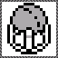<br>
Destroy the mind and complete Level 1 Mission 1
### [Achievement 459886](https://retroachievements.org/achievement/459886)
<sub>[Back to navigation](#achievements-navigation)</sub><br>
<br>Title: **Street Smarts**
<br>Author: [joshraphael](https://retroachievements.org/user/joshraphael)
<br>Type: ***missable***
<br>Points: **10**
<br>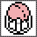<br>
Without taking damage, collect 1 heart, 1 gold bullion and 1 star and complete Level 1 Mission 1
### [Achievement 459887](https://retroachievements.org/achievement/459887)
<sub>[Back to navigation](#achievements-navigation)</sub><br>
<br>Title: **Ice Queen**
<br>Author: [joshraphael](https://retroachievements.org/user/joshraphael)
<br>Points: **5**
<br>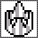<br>
Steal the Ice Queen's crown and complete Level 1 Mission 2
### [Achievement 459888](https://retroachievements.org/achievement/459888)
<sub>[Back to navigation](#achievements-navigation)</sub><br>
<br>Title: **Cold as Ice**
<br>Author: [joshraphael](https://retroachievements.org/user/joshraphael)
<br>Type: ***missable***
<br>Points: **10**
<br>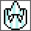<br>
Without taking damage, collect 1 heart and 1 star and complete Level 1 Mission 2
### [Achievement 459889](https://retroachievements.org/achievement/459889)
<sub>[Back to navigation](#achievements-navigation)</sub><br>
<br>Title: **Erase the Alchemist**
<br>Author: [joshraphael](https://retroachievements.org/user/joshraphael)
<br>Points: **5**
<br>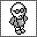<br>
Destroy the alchemist and complete Level 1 Mission 3
### [Achievement 459890](https://retroachievements.org/achievement/459890)
<sub>[Back to navigation](#achievements-navigation)</sub><br>
<br>Title: **The Scientist**
<br>Author: [joshraphael](https://retroachievements.org/user/joshraphael)
<br>Type: ***missable***
<br>Points: **10**
<br>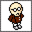<br>
Without taking damage, collect 1 heart, 1 gold bullion and 2 stars and complete Level 1 Mission 3
### [Achievement 459891](https://retroachievements.org/achievement/459891)
<sub>[Back to navigation](#achievements-navigation)</sub><br>
<br>Title: **The Journey Begins**
<br>Author: [joshraphael](https://retroachievements.org/user/joshraphael)
<br>Type: ***progression***
<br>Points: **10**
<br>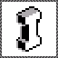<br>
Buy the lift pass for level 2 without using passwords, or if using passwords complete any two missions on level 1 before buying the lift pass for level 2
### [Achievement 459892](https://retroachievements.org/achievement/459892)
<sub>[Back to navigation](#achievements-navigation)</sub><br>
<br>Title: **Blind the Enemy**
<br>Author: [joshraphael](https://retroachievements.org/user/joshraphael)
<br>Points: **5**
<br>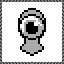<br>
Destroy the all seeing eye and complete Level 2 Mission 1
### [Achievement 459893](https://retroachievements.org/achievement/459893)
<sub>[Back to navigation](#achievements-navigation)</sub><br>
<br>Title: **Eye of the Tiger**
<br>Author: [joshraphael](https://retroachievements.org/user/joshraphael)
<br>Type: ***missable***
<br>Points: **10**
<br>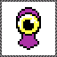<br>
Without taking damage, collect 1 heart and 2 stars and complete Level 2 Mission 1
### [Achievement 459894](https://retroachievements.org/achievement/459894)
<sub>[Back to navigation](#achievements-navigation)</sub><br>
<br>Title: **Secret Codex**
<br>Author: [joshraphael](https://retroachievements.org/user/joshraphael)
<br>Points: **5**
<br>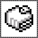<br>
Read the secret code and complete Level 2 Mission 2
### [Achievement 459895](https://retroachievements.org/achievement/459895)
<sub>[Back to navigation](#achievements-navigation)</sub><br>
<br>Title: **Lyrical Analysis**
<br>Author: [joshraphael](https://retroachievements.org/user/joshraphael)
<br>Type: ***missable***
<br>Points: **10**
<br>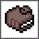<br>
Without taking damage, collect 1 heart, 1 gold bullion and 3 stars and complete Level 2 Mission 2
### [Achievement 459896](https://retroachievements.org/achievement/459896)
<sub>[Back to navigation](#achievements-navigation)</sub><br>
<br>Title: **Liftoff**
<br>Author: [joshraphael](https://retroachievements.org/user/joshraphael)
<br>Points: **5**
<br>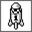<br>
Launch the self destructing rocket and complete Level 2 Mission 3
### [Achievement 459897](https://retroachievements.org/achievement/459897)
<sub>[Back to navigation](#achievements-navigation)</sub><br>
<br>Title: **Soar to the Top of the Charts**
<br>Author: [joshraphael](https://retroachievements.org/user/joshraphael)
<br>Type: ***missable***
<br>Points: **10**
<br>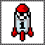<br>
Without taking damage, collect 1 heart and complete Level 2 Mission 3
### [Achievement 459898](https://retroachievements.org/achievement/459898)
<sub>[Back to navigation](#achievements-navigation)</sub><br>
<br>Title: **Double the Trouble**
<br>Author: [joshraphael](https://retroachievements.org/user/joshraphael)
<br>Type: ***progression***
<br>Points: **10**
<br>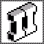<br>
Buy the lift pass for level 3 without using passwords, or if using passwords complete any two missions on level 2 before buying the lift pass for level 3
### [Achievement 459899](https://retroachievements.org/achievement/459899)
<sub>[Back to navigation](#achievements-navigation)</sub><br>
<br>Title: **Illuminate the Way**
<br>Author: [joshraphael](https://retroachievements.org/user/joshraphael)
<br>Points: **5**
<br>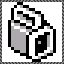<br>
Find the flashlight and complete Level 3 Mission 1
### [Achievement 459900](https://retroachievements.org/achievement/459900)
<sub>[Back to navigation](#achievements-navigation)</sub><br>
<br>Title: **Kick Out the Stage Lights**
<br>Author: [joshraphael](https://retroachievements.org/user/joshraphael)
<br>Type: ***missable***
<br>Points: **10**
<br>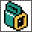<br>
Without taking damage, collect 1 heart and 2 stars and complete Level 3 Mission 1
### [Achievement 459901](https://retroachievements.org/achievement/459901)
<sub>[Back to navigation](#achievements-navigation)</sub><br>
<br>Title: **Circuit Breaker**
<br>Author: [joshraphael](https://retroachievements.org/user/joshraphael)
<br>Points: **5**
<br>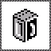<br>
Find the electrical control box and complete Level 3 Mission 2
### [Achievement 459902](https://retroachievements.org/achievement/459902)
<sub>[Back to navigation](#achievements-navigation)</sub><br>
<br>Title: **Overdrive**
<br>Author: [joshraphael](https://retroachievements.org/user/joshraphael)
<br>Type: ***missable***
<br>Points: **10**
<br>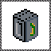<br>
Without taking damage, collect 1 heart, 2 gold bullions and 3 stars and complete Level 3 Mission 2
### [Achievement 459903](https://retroachievements.org/achievement/459903)
<sub>[Back to navigation](#achievements-navigation)</sub><br>
<br>Title: **Startup Funds**
<br>Author: [joshraphael](https://retroachievements.org/user/joshraphael)
<br>Points: **5**
<br>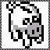<br>
Search for the piggy bank and complete Level 3 Mission 3
### [Achievement 459904](https://retroachievements.org/achievement/459904)
<sub>[Back to navigation](#achievements-navigation)</sub><br>
<br>Title: **Sold Out Concert**
<br>Author: [joshraphael](https://retroachievements.org/user/joshraphael)
<br>Type: ***missable***
<br>Points: **10**
<br>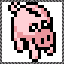<br>
Without taking damage, collect 1 heart, 1 gold bullion and 2 stars and complete Level 3 Mission 3
### [Achievement 459905](https://retroachievements.org/achievement/459905)
<sub>[Back to navigation](#achievements-navigation)</sub><br>
<br>Title: **It's a Long Way to the Top**
<br>Author: [joshraphael](https://retroachievements.org/user/joshraphael)
<br>Type: ***progression***
<br>Points: **10**
<br>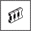<br>
Buy the lift pass for level 4 without using passwords, or if using passwords complete any two missions on level 3 before buying the lift pass for level 4
### [Achievement 459906](https://retroachievements.org/achievement/459906)
<sub>[Back to navigation](#achievements-navigation)</sub><br>
<br>Title: **Time Keeper**
<br>Author: [joshraphael](https://retroachievements.org/user/joshraphael)
<br>Points: **5**
<br>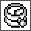<br>
Collect the pocketwatch and complete Level 4 Mission 1
### [Achievement 459907](https://retroachievements.org/achievement/459907)
<sub>[Back to navigation](#achievements-navigation)</sub><br>
<br>Title: **It's Show Time!**
<br>Author: [joshraphael](https://retroachievements.org/user/joshraphael)
<br>Type: ***missable***
<br>Points: **10**
<br>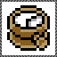<br>
Without taking damage, collect 1 heart and 1 gold bullion and complete Level 4 Mission 1
### [Achievement 459908](https://retroachievements.org/achievement/459908)
<sub>[Back to navigation](#achievements-navigation)</sub><br>
<br>Title: **Food Poisoning**
<br>Author: [joshraphael](https://retroachievements.org/user/joshraphael)
<br>Points: **5**
<br>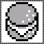<br>
Get rid of the poisoned food and complete Level 4 Mission 2
### [Achievement 459909](https://retroachievements.org/achievement/459909)
<sub>[Back to navigation](#achievements-navigation)</sub><br>
<br>Title: **Rock and McRoll**
<br>Author: [joshraphael](https://retroachievements.org/user/joshraphael)
<br>Type: ***missable***
<br>Points: **10**
<br>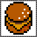<br>
Without taking damage, collect 1 heart, 1 gold bullion and 1 star and complete Level 4 Mission 2
### [Achievement 459910](https://retroachievements.org/achievement/459910)
<sub>[Back to navigation](#achievements-navigation)</sub><br>
<br>Title: **Command an Army**
<br>Author: [joshraphael](https://retroachievements.org/user/joshraphael)
<br>Points: **5**
<br>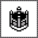<br>
Earn the crown of attack and complete Level 4 Mission 3
### [Achievement 459911](https://retroachievements.org/achievement/459911)
<sub>[Back to navigation](#achievements-navigation)</sub><br>
<br>Title: **The King of Rock**
<br>Author: [joshraphael](https://retroachievements.org/user/joshraphael)
<br>Type: ***missable***
<br>Points: **10**
<br><br>
Without taking damage, collect 1 heart, 1 gold bullion and 1 star and complete Level 4 Mission 3
### [Achievement 459912](https://retroachievements.org/achievement/459912)
<sub>[Back to navigation](#achievements-navigation)</sub><br>
<br>Title: **Don't Stop Believin'**
<br>Author: [joshraphael](https://retroachievements.org/user/joshraphael)
<br>Type: ***progression***
<br>Points: **10**
<br><br>
Buy the lift pass for level 5 without using passwords, or if using passwords complete any two missions on level 4 before buying the lift pass for level 5
### [Achievement 459913](https://retroachievements.org/achievement/459913)
<sub>[Back to navigation](#achievements-navigation)</sub><br>
<br>Title: **Ghost Ship**
<br>Author: [joshraphael](https://retroachievements.org/user/joshraphael)
<br>Points: **5**
<br>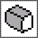<br>
Take the ghost ship wood log and complete Level 5 Mission 1
### [Achievement 459914](https://retroachievements.org/achievement/459914)
<sub>[Back to navigation](#achievements-navigation)</sub><br>
<br>Title: **Rock the Boat**
<br>Author: [joshraphael](https://retroachievements.org/user/joshraphael)
<br>Type: ***missable***
<br>Points: **10**
<br>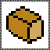<br>
Without taking damage, collect 1 heart, 2 gold bullions and 1 star and complete Level 5 Mission 1
### [Achievement 459915](https://retroachievements.org/achievement/459915)
<sub>[Back to navigation](#achievements-navigation)</sub><br>
<br>Title: **Talk to the Dead**
<br>Author: [joshraphael](https://retroachievements.org/user/joshraphael)
<br>Points: **5**
<br>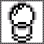<br>
Collect the crystal ball and complete Level 5 Mission 2
### [Achievement 459916](https://retroachievements.org/achievement/459916)
<sub>[Back to navigation](#achievements-navigation)</sub><br>
<br>Title: **Fortune Teller**
<br>Author: [joshraphael](https://retroachievements.org/user/joshraphael)
<br>Type: ***missable***
<br>Points: **10**
<br>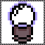<br>
Without taking damage, collect 1 heart and 1 star and complete Level 5 Mission 2
### [Achievement 459917](https://retroachievements.org/achievement/459917)
<sub>[Back to navigation](#achievements-navigation)</sub><br>
<br>Title: **Keeping Warm**
<br>Author: [joshraphael](https://retroachievements.org/user/joshraphael)
<br>Points: **5**
<br>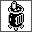<br>
Use the wood stove and complete Level 5 Mission 3
### [Achievement 459918](https://retroachievements.org/achievement/459918)
<sub>[Back to navigation](#achievements-navigation)</sub><br>
<br>Title: **Through the Fire and Flames**
<br>Author: [joshraphael](https://retroachievements.org/user/joshraphael)
<br>Type: ***missable***
<br>Points: **10**
<br>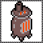<br>
Without taking damage, collect 1 heart and 1 star and complete Level 5 Mission 3
### [Achievement 459919](https://retroachievements.org/achievement/459919)
<sub>[Back to navigation](#achievements-navigation)</sub><br>
<br>Title: **Just Move On Up**
<br>Author: [joshraphael](https://retroachievements.org/user/joshraphael)
<br>Type: ***progression***
<br>Points: **10**
<br>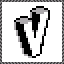<br>
Buy the lift pass for level 6 without using passwords, or if using passwords complete any two missions on level 5 before buying the lift pass for level 6
### [Achievement 459920](https://retroachievements.org/achievement/459920)
<sub>[Back to navigation](#achievements-navigation)</sub><br>
<br>Title: **In Safe Hands**
<br>Author: [joshraphael](https://retroachievements.org/user/joshraphael)
<br>Points: **5**
<br>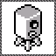<br>
Return the safe and complete Level 6 Mission 1
### [Achievement 459921](https://retroachievements.org/achievement/459921)
<sub>[Back to navigation](#achievements-navigation)</sub><br>
<br>Title: **The Unreleased Album**
<br>Author: [joshraphael](https://retroachievements.org/user/joshraphael)
<br>Type: ***missable***
<br>Points: **10**
<br>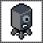<br>
Without taking damage, collect 1 gold bullion and complete Level 6 Mission 1
### [Achievement 459922](https://retroachievements.org/achievement/459922)
<sub>[Back to navigation](#achievements-navigation)</sub><br>
<br>Title: **Enchantment**
<br>Author: [joshraphael](https://retroachievements.org/user/joshraphael)
<br>Points: **5**
<br>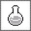<br>
Smash the potion vial and complete Level 6 Mission 2
### [Achievement 459923](https://retroachievements.org/achievement/459923)
<sub>[Back to navigation](#achievements-navigation)</sub><br>
<br>Title: **THE CONCOCTION**
<br>Author: [joshraphael](https://retroachievements.org/user/joshraphael)
<br>Type: ***missable***
<br>Points: **10**
<br>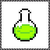<br>
Without taking damage, collect 1 heart and complete Level 6 Mission 2
### [Achievement 459924](https://retroachievements.org/achievement/459924)
<sub>[Back to navigation](#achievements-navigation)</sub><br>
<br>Title: **Cursed Gem**
<br>Author: [joshraphael](https://retroachievements.org/user/joshraphael)
<br>Points: **5**
<br>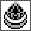<br>
Destroy the dark jewel and complete Level 6 Mission 3
### [Achievement 459925](https://retroachievements.org/achievement/459925)
<sub>[Back to navigation](#achievements-navigation)</sub><br>
<br>Title: **Bejeweled**
<br>Author: [joshraphael](https://retroachievements.org/user/joshraphael)
<br>Type: ***missable***
<br>Points: **10**
<br>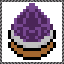<br>
Without taking damage, collect 1 heart and 1 star and complete Level 6 Mission 3
### [Achievement 459926](https://retroachievements.org/achievement/459926)
<sub>[Back to navigation](#achievements-navigation)</sub><br>
<br>Title: **Takin' Care of Business**
<br>Author: [joshraphael](https://retroachievements.org/user/joshraphael)
<br>Type: ***progression***
<br>Points: **10**
<br>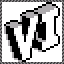<br>
Buy the lift pass for level 7 without using passwords, or if using passwords complete any two missions on level 6 before buying the lift pass for level 7
### [Achievement 459927](https://retroachievements.org/achievement/459927)
<sub>[Back to navigation](#achievements-navigation)</sub><br>
<br>Title: **POP!**
<br>Author: [joshraphael](https://retroachievements.org/user/joshraphael)
<br>Points: **5**
<br>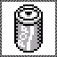<br>
Earn the fizzy soda prize and complete Level 7 Mission 1
### [Achievement 459928](https://retroachievements.org/achievement/459928)
<sub>[Back to navigation](#achievements-navigation)</sub><br>
<br>Title: **Have a Drink on Me**
<br>Author: [joshraphael](https://retroachievements.org/user/joshraphael)
<br>Type: ***missable***
<br>Points: **10**
<br>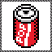<br>
Without taking damage, collect 1 heart, 1 gold bullion and 4 stars and complete Level 7 Mission 1
### [Achievement 459929](https://retroachievements.org/achievement/459929)
<sub>[Back to navigation](#achievements-navigation)</sub><br>
<br>Title: **Waiting for a Call**
<br>Author: [joshraphael](https://retroachievements.org/user/joshraphael)
<br>Points: **5**
<br>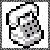<br>
Collect the phone and complete Level 7 Mission 2
### [Achievement 459930](https://retroachievements.org/achievement/459930)
<sub>[Back to navigation](#achievements-navigation)</sub><br>
<br>Title: **Off the Hook**
<br>Author: [joshraphael](https://retroachievements.org/user/joshraphael)
<br>Type: ***missable***
<br>Points: **10**
<br>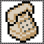<br>
Without taking damage, collect 1 heart, 1 gold bullion and 3 stars and complete Level 7 Mission 2
### [Achievement 459931](https://retroachievements.org/achievement/459931)
<sub>[Back to navigation](#achievements-navigation)</sub><br>
<br>Title: **S.O.S**
<br>Author: [joshraphael](https://retroachievements.org/user/joshraphael)
<br>Points: **5**
<br>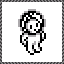<br>
Release the captive voyager and complete Level 7 Mission 3
### [Achievement 459932](https://retroachievements.org/achievement/459932)
<sub>[Back to navigation](#achievements-navigation)</sub><br>
<br>Title: **Message in a Bottle**
<br>Author: [joshraphael](https://retroachievements.org/user/joshraphael)
<br>Type: ***missable***
<br>Points: **10**
<br><br>
Without taking damage, collect 1 heart and 3 stars and complete Level 7 Mission 3
### [Achievement 459933](https://retroachievements.org/achievement/459933)
<sub>[Back to navigation](#achievements-navigation)</sub><br>
<br>Title: **Stairway to Heaven**
<br>Author: [joshraphael](https://retroachievements.org/user/joshraphael)
<br>Type: ***progression***
<br>Points: **10**
<br>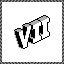<br>
Buy the lift pass for level 8 without using passwords, or if using passwords complete any two missions on level 7 before buying the lift pass for level 8
### [Achievement 459934](https://retroachievements.org/achievement/459934)
<sub>[Back to navigation](#achievements-navigation)</sub><br>
<br>Title: **K9 Companion**
<br>Author: [joshraphael](https://retroachievements.org/user/joshraphael)
<br>Points: **5**
<br>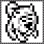<br>
Rescue the dog and complete Level 8 Mission 1
### [Achievement 459935](https://retroachievements.org/achievement/459935)
<sub>[Back to navigation](#achievements-navigation)</sub><br>
<br>Title: **Who Let the Dogs Out?**
<br>Author: [joshraphael](https://retroachievements.org/user/joshraphael)
<br>Type: ***missable***
<br>Points: **10**
<br>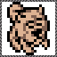<br>
Without taking damage, collect 1 heart and 1 star and complete Level 8 Mission 1
### [Achievement 459936](https://retroachievements.org/achievement/459936)
<sub>[Back to navigation](#achievements-navigation)</sub><br>
<br>Title: **Fast Getaway**
<br>Author: [joshraphael](https://retroachievements.org/user/joshraphael)
<br>Points: **5**
<br>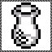<br>
Find and flee with the amphora jar and complete Level 8 Mission 2
### [Achievement 459937](https://retroachievements.org/achievement/459937)
<sub>[Back to navigation](#achievements-navigation)</sub><br>
<br>Title: **Rock You like a Hurricane**
<br>Author: [joshraphael](https://retroachievements.org/user/joshraphael)
<br>Type: ***missable***
<br>Points: **10**
<br>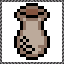<br>
Without taking damage, collect 1 heart and 3 stars and complete Level 8 Mission 2
### [Achievement 459938](https://retroachievements.org/achievement/459938)
<sub>[Back to navigation](#achievements-navigation)</sub><br>
<br>Title: **Piece of Cake**
<br>Author: [joshraphael](https://retroachievements.org/user/joshraphael)
<br>Points: **5**
<br><br>
Eat the triple decker cake and complete Level 8 Mission 3
### [Achievement 459939](https://retroachievements.org/achievement/459939)
<sub>[Back to navigation](#achievements-navigation)</sub><br>
<br>Title: **Fight for Your Right to Party**
<br>Author: [joshraphael](https://retroachievements.org/user/joshraphael)
<br>Type: ***missable***
<br>Points: **10**
<br><br>
Without taking damage, collect 1 heart, 1 gold bullion and 5 stars and complete Level 8 Mission 3
### [Achievement 459940](https://retroachievements.org/achievement/459940)
<sub>[Back to navigation](#achievements-navigation)</sub><br>
<br>Title: **A Rising Star**
<br>Author: [joshraphael](https://retroachievements.org/user/joshraphael)
<br>Type: ***progression***
<br>Points: **10**
<br><br>
Buy the lift pass for level 9 without using passwords, or if using passwords complete any two missions on level 8 before buying the lift pass for level 9
### [Achievement 459941](https://retroachievements.org/achievement/459941)
<sub>[Back to navigation](#achievements-navigation)</sub><br>
<br>Title: **Hacking the Mainframe**
<br>Author: [joshraphael](https://retroachievements.org/user/joshraphael)
<br>Points: **5**
<br><br>
Destroy the computer system and complete Level 9 Mission 1
### [Achievement 459942](https://retroachievements.org/achievement/459942)
<sub>[Back to navigation](#achievements-navigation)</sub><br>
<br>Title: **Technologic**
<br>Author: [joshraphael](https://retroachievements.org/user/joshraphael)
<br>Type: ***missable***
<br>Points: **10**
<br><br>
Without taking damage, collect 1 heart and 5 stars and complete Level 9 Mission 1
### [Achievement 459943](https://retroachievements.org/achievement/459943)
<sub>[Back to navigation](#achievements-navigation)</sub><br>
<br>Title: **Infestation**
<br>Author: [joshraphael](https://retroachievements.org/user/joshraphael)
<br>Points: **5**
<br><br>
Smash open the jar of insects and complete Level 9 Mission 2
### [Achievement 459944](https://retroachievements.org/achievement/459944)
<sub>[Back to navigation](#achievements-navigation)</sub><br>
<br>Title: **Squash Those Beetles**
<br>Author: [joshraphael](https://retroachievements.org/user/joshraphael)
<br>Type: ***missable***
<br>Points: **10**
<br><br>
Without taking damage, collect 1 heart, 2 gold bullions and 3 stars and complete Level 9 Mission 2
### [Achievement 459945](https://retroachievements.org/achievement/459945)
<sub>[Back to navigation](#achievements-navigation)</sub><br>
<br>Title: **Home Sweet Home**
<br>Author: [joshraphael](https://retroachievements.org/user/joshraphael)
<br>Points: **5**
<br><br>
Find a new home and complete Level 9 Mission 3
### [Achievement 459946](https://retroachievements.org/achievement/459946)
<sub>[Back to navigation](#achievements-navigation)</sub><br>
<br>Title: **Mansion Tour**
<br>Author: [joshraphael](https://retroachievements.org/user/joshraphael)
<br>Type: ***missable***
<br>Points: **10**
<br><br>
Without taking damage, collect 1 heart and 1 star and complete Level 9 Mission 3
### [Achievement 459947](https://retroachievements.org/achievement/459947)
<sub>[Back to navigation](#achievements-navigation)</sub><br>
<br>Title: **School's Out!**
<br>Author: [joshraphael](https://retroachievements.org/user/joshraphael)
<br>Type: ***progression***
<br>Points: **10**
<br><br>
Buy the lift pass for level 10 without using passwords, or if using passwords complete any two missions on level 9 before buying the lift pass for level 10
### [Achievement 459948](https://retroachievements.org/achievement/459948)
<sub>[Back to navigation](#achievements-navigation)</sub><br>
<br>Title: **King Krond**
<br>Author: [joshraphael](https://retroachievements.org/user/joshraphael)
<br>Type: ***win_condition***
<br>Points: **25**
<br><br>
Defeat Krond and save the Mega Hero Academy!
### [Achievement 459950](https://retroachievements.org/achievement/459950)
<sub>[Back to navigation](#achievements-navigation)</sub><br>
<br>Title: **Speedy**
<br>Author: [joshraphael](https://retroachievements.org/user/joshraphael)
<br>Points: **2**
<br><br>
Pick up a lightning in any mission
### [Achievement 459951](https://retroachievements.org/achievement/459951)
<sub>[Back to navigation](#achievements-navigation)</sub><br>
<br>Title: **Jump to the Rescue**
<br>Author: [joshraphael](https://retroachievements.org/user/joshraphael)
<br>Points: **2**
<br><br>
Pick up a power spring in any mission except the Play Pen
### [Achievement 459952](https://retroachievements.org/achievement/459952)
<sub>[Back to navigation](#achievements-navigation)</sub><br>
<br>Title: **Invincible**
<br>Author: [joshraphael](https://retroachievements.org/user/joshraphael)
<br>Points: **2**
<br><br>
Pick up a power ring in any mission
### [Achievement 459953](https://retroachievements.org/achievement/459953)
<sub>[Back to navigation](#achievements-navigation)</sub><br>
<br>Title: **I'm the Map**
<br>Author: [joshraphael](https://retroachievements.org/user/joshraphael)
<br>Points: **2**
<br><br>
If there's a place you got to get, a map can get you there, I bet. Find a map to reveal the mission layout
## Leaderboards
<sub>[Back to Table of Contents](#table-of-contents)</sub>
### Leaderboards Navigation
1. [Speedrun Monster Max (Leaderboard 114798)](#leaderboard-114798)
2. [High Score (Leaderboard 114799)](#leaderboard-114799)
3. [Speedrun Play Pen (Leaderboard 114800)](#leaderboard-114800)
4. [Speedrun Level 1 Mission 1 (Leaderboard 114801)](#leaderboard-114801)
5. [Speedrun Level 1 Mission 2 (Leaderboard 114802)](#leaderboard-114802)
6. [Speedrun Level 1 Mission 3 (Leaderboard 114803)](#leaderboard-114803)
7. [Speedrun Level 2 Mission 1 (Leaderboard 114804)](#leaderboard-114804)
8. [Speedrun Level 2 Mission 2 (Leaderboard 114805)](#leaderboard-114805)
9. [Speedrun Level 2 Mission 3 (Leaderboard 114806)](#leaderboard-114806)
10. [Speedrun Level 3 Mission 1 (Leaderboard 114807)](#leaderboard-114807)
11. [Speedrun Level 3 Mission 2 (Leaderboard 114808)](#leaderboard-114808)
12. [Speedrun Level 3 Mission 3 (Leaderboard 114809)](#leaderboard-114809)
13. [Speedrun Level 4 Mission 1 (Leaderboard 114810)](#leaderboard-114810)
14. [Speedrun Level 4 Mission 2 (Leaderboard 114811)](#leaderboard-114811)
15. [Speedrun Level 4 Mission 3 (Leaderboard 114812)](#leaderboard-114812)
16. [Speedrun Level 5 Mission 1 (Leaderboard 114813)](#leaderboard-114813)
17. [Speedrun Level 5 Mission 2 (Leaderboard 114814)](#leaderboard-114814)
18. [Speedrun Level 5 Mission 3 (Leaderboard 114815)](#leaderboard-114815)
19. [Speedrun Level 6 Mission 1 (Leaderboard 114816)](#leaderboard-114816)
20. [Speedrun Level 6 Mission 2 (Leaderboard 114817)](#leaderboard-114817)
21. [Speedrun Level 6 Mission 3 (Leaderboard 114818)](#leaderboard-114818)
22. [Speedrun Level 7 Mission 1 (Leaderboard 114819)](#leaderboard-114819)
23. [Speedrun Level 7 Mission 2 (Leaderboard 114820)](#leaderboard-114820)
24. [Speedrun Level 7 Mission 3 (Leaderboard 114821)](#leaderboard-114821)
25. [Speedrun Level 8 Mission 1 (Leaderboard 114822)](#leaderboard-114822)
26. [Speedrun Level 8 Mission 2 (Leaderboard 114823)](#leaderboard-114823)
27. [Speedrun Level 8 Mission 3 (Leaderboard 114824)](#leaderboard-114824)
28. [Speedrun Level 9 Mission 1 (Leaderboard 114825)](#leaderboard-114825)
29. [Speedrun Level 9 Mission 2 (Leaderboard 114826)](#leaderboard-114826)
30. [Speedrun Level 9 Mission 3 (Leaderboard 114827)](#leaderboard-114827)
31. [Speedrun Level 10 Mission 1 (Leaderboard 114828)](#leaderboard-114828)
### [Leaderboard 114798](https://retroachievements.org/leaderboardinfo.php?i=114798)
<sub>[Back to navigation](#leaderboards-navigation)</sub><br>
<br>Title: Speedrun Monster Max<br><br>
Complete the game from start to finish as fast as possible without using passwords
### [Leaderboard 114799](https://retroachievements.org/leaderboardinfo.php?i=114799)
<sub>[Back to navigation](#leaderboards-navigation)</sub><br>
<br>Title: High Score<br><br>
Complete the game from start to finish with the most credits and stars without using passwords
### [Leaderboard 114800](https://retroachievements.org/leaderboardinfo.php?i=114800)
<sub>[Back to navigation](#leaderboards-navigation)</sub><br>
<br>Title: Speedrun Play Pen<br><br>
Complete Play Pen from start to finish as fast as possible without using passwords
### [Leaderboard 114801](https://retroachievements.org/leaderboardinfo.php?i=114801)
<sub>[Back to navigation](#leaderboards-navigation)</sub><br>
<br>Title: Speedrun Level 1 Mission 1<br><br>
Complete Level 1 Mission 1 from start to finish as fast as possible without using passwords
### [Leaderboard 114802](https://retroachievements.org/leaderboardinfo.php?i=114802)
<sub>[Back to navigation](#leaderboards-navigation)</sub><br>
<br>Title: Speedrun Level 1 Mission 2<br><br>
Complete Level 1 Mission 2 from start to finish as fast as possible without using passwords
### [Leaderboard 114803](https://retroachievements.org/leaderboardinfo.php?i=114803)
<sub>[Back to navigation](#leaderboards-navigation)</sub><br>
<br>Title: Speedrun Level 1 Mission 3<br><br>
Complete Level 1 Mission 3 from start to finish as fast as possible without using passwords
### [Leaderboard 114804](https://retroachievements.org/leaderboardinfo.php?i=114804)
<sub>[Back to navigation](#leaderboards-navigation)</sub><br>
<br>Title: Speedrun Level 2 Mission 1<br><br>
Complete Level 2 Mission 1 from start to finish as fast as possible without using passwords
### [Leaderboard 114805](https://retroachievements.org/leaderboardinfo.php?i=114805)
<sub>[Back to navigation](#leaderboards-navigation)</sub><br>
<br>Title: Speedrun Level 2 Mission 2<br><br>
Complete Level 2 Mission 2 from start to finish as fast as possible without using passwords
### [Leaderboard 114806](https://retroachievements.org/leaderboardinfo.php?i=114806)
<sub>[Back to navigation](#leaderboards-navigation)</sub><br>
<br>Title: Speedrun Level 2 Mission 3<br><br>
Complete Level 2 Mission 3 from start to finish as fast as possible without using passwords
### [Leaderboard 114807](https://retroachievements.org/leaderboardinfo.php?i=114807)
<sub>[Back to navigation](#leaderboards-navigation)</sub><br>
<br>Title: Speedrun Level 3 Mission 1<br><br>
Complete Level 3 Mission 1 from start to finish as fast as possible without using passwords
### [Leaderboard 114808](https://retroachievements.org/leaderboardinfo.php?i=114808)
<sub>[Back to navigation](#leaderboards-navigation)</sub><br>
<br>Title: Speedrun Level 3 Mission 2<br><br>
Complete Level 3 Mission 2 from start to finish as fast as possible without using passwords
### [Leaderboard 114809](https://retroachievements.org/leaderboardinfo.php?i=114809)
<sub>[Back to navigation](#leaderboards-navigation)</sub><br>
<br>Title: Speedrun Level 3 Mission 3<br><br>
Complete Level 3 Mission 3 from start to finish as fast as possible without using passwords
### [Leaderboard 114810](https://retroachievements.org/leaderboardinfo.php?i=114810)
<sub>[Back to navigation](#leaderboards-navigation)</sub><br>
<br>Title: Speedrun Level 4 Mission 1<br><br>
Complete Level 4 Mission 1 from start to finish as fast as possible without using passwords
### [Leaderboard 114811](https://retroachievements.org/leaderboardinfo.php?i=114811)
<sub>[Back to navigation](#leaderboards-navigation)</sub><br>
<br>Title: Speedrun Level 4 Mission 2<br><br>
Complete Level 4 Mission 2 from start to finish as fast as possible without using passwords
### [Leaderboard 114812](https://retroachievements.org/leaderboardinfo.php?i=114812)
<sub>[Back to navigation](#leaderboards-navigation)</sub><br>
<br>Title: Speedrun Level 4 Mission 3<br><br>
Complete Level 4 Mission 3 from start to finish as fast as possible without using passwords
### [Leaderboard 114813](https://retroachievements.org/leaderboardinfo.php?i=114813)
<sub>[Back to navigation](#leaderboards-navigation)</sub><br>
<br>Title: Speedrun Level 5 Mission 1<br><br>
Complete Level 5 Mission 1 from start to finish as fast as possible without using passwords
### [Leaderboard 114814](https://retroachievements.org/leaderboardinfo.php?i=114814)
<sub>[Back to navigation](#leaderboards-navigation)</sub><br>
<br>Title: Speedrun Level 5 Mission 2<br><br>
Complete Level 5 Mission 2 from start to finish as fast as possible without using passwords
### [Leaderboard 114815](https://retroachievements.org/leaderboardinfo.php?i=114815)
<sub>[Back to navigation](#leaderboards-navigation)</sub><br>
<br>Title: Speedrun Level 5 Mission 3<br><br>
Complete Level 5 Mission 3 from start to finish as fast as possible without using passwords
### [Leaderboard 114816](https://retroachievements.org/leaderboardinfo.php?i=114816)
<sub>[Back to navigation](#leaderboards-navigation)</sub><br>
<br>Title: Speedrun Level 6 Mission 1<br><br>
Complete Level 6 Mission 1 from start to finish as fast as possible without using passwords
### [Leaderboard 114817](https://retroachievements.org/leaderboardinfo.php?i=114817)
<sub>[Back to navigation](#leaderboards-navigation)</sub><br>
<br>Title: Speedrun Level 6 Mission 2<br><br>
Complete Level 6 Mission 2 from start to finish as fast as possible without using passwords
### [Leaderboard 114818](https://retroachievements.org/leaderboardinfo.php?i=114818)
<sub>[Back to navigation](#leaderboards-navigation)</sub><br>
<br>Title: Speedrun Level 6 Mission 3<br><br>
Complete Level 6 Mission 3 from start to finish as fast as possible without using passwords
### [Leaderboard 114819](https://retroachievements.org/leaderboardinfo.php?i=114819)
<sub>[Back to navigation](#leaderboards-navigation)</sub><br>
<br>Title: Speedrun Level 7 Mission 1<br><br>
Complete Level 7 Mission 1 from start to finish as fast as possible without using passwords
### [Leaderboard 114820](https://retroachievements.org/leaderboardinfo.php?i=114820)
<sub>[Back to navigation](#leaderboards-navigation)</sub><br>
<br>Title: Speedrun Level 7 Mission 2<br><br>
Complete Level 7 Mission 2 from start to finish as fast as possible without using passwords
### [Leaderboard 114821](https://retroachievements.org/leaderboardinfo.php?i=114821)
<sub>[Back to navigation](#leaderboards-navigation)</sub><br>
<br>Title: Speedrun Level 7 Mission 3<br><br>
Complete Level 7 Mission 3 from start to finish as fast as possible without using passwords
### [Leaderboard 114822](https://retroachievements.org/leaderboardinfo.php?i=114822)
<sub>[Back to navigation](#leaderboards-navigation)</sub><br>
<br>Title: Speedrun Level 8 Mission 1<br><br>
Complete Level 8 Mission 1 from start to finish as fast as possible without using passwords
### [Leaderboard 114823](https://retroachievements.org/leaderboardinfo.php?i=114823)
<sub>[Back to navigation](#leaderboards-navigation)</sub><br>
<br>Title: Speedrun Level 8 Mission 2<br><br>
Complete Level 8 Mission 2 from start to finish as fast as possible without using passwords
### [Leaderboard 114824](https://retroachievements.org/leaderboardinfo.php?i=114824)
<sub>[Back to navigation](#leaderboards-navigation)</sub><br>
<br>Title: Speedrun Level 8 Mission 3<br><br>
Complete Level 8 Mission 3 from start to finish as fast as possible without using passwords
### [Leaderboard 114825](https://retroachievements.org/leaderboardinfo.php?i=114825)
<sub>[Back to navigation](#leaderboards-navigation)</sub><br>
<br>Title: Speedrun Level 9 Mission 1<br><br>
Complete Level 9 Mission 1 from start to finish as fast as possible without using passwords
### [Leaderboard 114826](https://retroachievements.org/leaderboardinfo.php?i=114826)
<sub>[Back to navigation](#leaderboards-navigation)</sub><br>
<br>Title: Speedrun Level 9 Mission 2<br><br>
Complete Level 9 Mission 2 from start to finish as fast as possible without using passwords
### [Leaderboard 114827](https://retroachievements.org/leaderboardinfo.php?i=114827)
<sub>[Back to navigation](#leaderboards-navigation)</sub><br>
<br>Title: Speedrun Level 9 Mission 3<br><br>
Complete Level 9 Mission 3 from start to finish as fast as possible without using passwords
### [Leaderboard 114828](https://retroachievements.org/leaderboardinfo.php?i=114828)
<sub>[Back to navigation](#leaderboards-navigation)</sub><br>
<br>Title: Speedrun Level 10 Mission 1<br><br>
Complete Level 10 Mission 1 from start to finish as fast as possible without using passwords