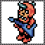

# Design Doc

## Table of Contents

1. [About](#about)
2. [Learnings](#learnings)
3. [Code Notes](#code-notes)
4. [Achievements](#achievements)
5. [Rich Presence](#rich-presence)

## About

[Back to Table of Contents](#table-of-contents)

* [Wikipedia](https://en.wikipedia.org/wiki/Monster_Max)
* [RetroAchievements](https://retroachievements.org/game/4111)
* [Walkthrough](https://gamefaqs.gamespot.com/gameboy/585809-monster-max/faqs/36096)
* [YouTube Video Playthrough](https://www.youtube.com/watch?v=p4EVqKSPrcs)

## Learnings

[Back to Table of Contents](#table-of-contents)

### Passwords

While playing through the game there is no save state for it, meaning if you play a few levels and want to quit and come back at a later time, the only way to "restore" your progress is by using the password system. The password system will place you at a specific point in the game. As far as i can tell passwords are characteristics of the player encoded. the values that are encoded seem to be a combination of: credits, levels completed, number of stars, and level pass obtained. Through some trial and error unfortunately I am unable to convert these values into passwords to try and thrwart the password system abuse for acheivements. There are no set passwords in the game, only the ability to enter 8 characters that can be any of the 32 characters supported in the system, making the game have thousands of passwords to chose from so hard coding password protection is not going to happen with no reliable way to generate passwords from the characteristics provided.

Playing with passwords seems to create a new password hash any time one of those characteristics changes, but when loading the game state in the game, it removes all lucky stars. You can never enter a password and get stars or specific items in your slots. the only thing that matters is lift pass level, missions completed flags, and credits. Also while playing with the password system it appears that there is some level of anti-cheat in the game. meaning you cant start the game with 9999 credits, you will need to enter a password hash that makes a valid game state. I do notice that some of the credits I manually calculate for what you can have at that point in the game differ from what passwords allow. This may be a buffer by the developers for some reason as I see no way to earn these extra points in the game. I will note what each levels max points can be with passwords in the Level details section below.

### Levels

There is 1 play pen, 9 levels with 3 missions each, and a final 10th level with one mission to complete the game. players cant move up to the next level unless the gather credits by completing missions on the floors they have access to. there is a way around completing levels by using passwords, either using one of the well known passwords on the internet to go to the end of the game and have all the lift passes, or getting a password that just gives you all the lift passes for free. Therefore level progression achievements need session and password protection to avoid players just going to the level prior with the max credits, and buying the next pass without playing the game since thats a valid state to get "free" points.

### Stars

Stars are accumulated by collecting them in the missions and displayed as a number in the top left of th screen. They allow you to take damage without losing a heart, its like a one hit protection and the more you collect the more hits you can take without loosing hearts. This is one of the ways players could cheat in the game to get achievements using the password system. they could find a password that gives you tons of stars before a mission and then the mission will be free. its hard to thward other than calculating the max amount of stars you can get before each level and ensuring they dont go over it. other than that we cant reliably tell if they got the star legitimatly or not.

### Detailed Mission Parameters

Totals calcultion formula: `Reward + ((Given Hearts + In-Game Hearts + Gold Bullions) * Bonus Multiplier)`

Play Pen:
* Reward: 1 credit
* Given Hearts: 0
* Bonus Multiplier: 0 credits
* In-Game Hearts: 0
* Gold Bullions: 0
* Stars: 0
* Lightning: 0
* Power Spring: 1
* Power Ring: 0
* Map: 0
* Total: 1 + ((0 + 0 + 0) * 0) = 1 credits max

Level 1 Mission 1:
* Reward: 30 credits
* Given Hearts: 4
* Bonus Multiplier: 3 credits
* In-Game Hearts: 1
* Gold Bullions: 1
* Stars: 1
* Lightning: 1
* Power Spring: 0
* Power Ring: 0
* Map: 0
* Total: 30 + ((4 + 1 + 1) * 3) = 48 credits max

Level 1 Mission 2:
* Reward: 30 credits
* Given Hearts: 4
* Bonus Multiplier: 3 credits
* In-Game Hearts: 1
* Gold Bullions: 0
* Stars: 1
* Lightning: 0
* Power Spring: 1
* Power Ring: 0
* Map: 0
* Total: 30 + ((4 + 1 + 0) * 3) = 45 credits max

Level 1 Mission 3:
* Reward: 45 credits
* Given Hearts: 4
* Bonus Multiplier: 3 credits
* In-Game Hearts: 1
* Gold Bullions: 1
* Stars: 2
* Lightning: 2
* Power Spring: 0
* Power Ring: 1
* Map: 1
* Total: 45 + ((4 + 1 + 1) * 3) = 63 credits max

Level 1 Summary:
* Games Internal Max Credits With Passwords: 159
* Max credits: 1 + 48 + 45 + 63 = 157 credits
* Max stars: 4
* Lift Pass Cost: 70 credits
* Max credits after buying lift pass: 157 - 70 = 87 credits

Level 2 Mission 1:
* Reward: 45 credits
* Given Hearts: 4
* Bonus Multiplier: 7 credits
* In-Game Hearts: 1
* Gold Bullions: 0
* Stars: 2
* Lightning: 1
* Power Spring: 0
* Power Ring: 0
* Map: 1
* Total: 45 + ((4 + 1 + 0) * 7) = 80 credits max

Level 2 Mission 2:
* Reward: 40 credits
* Given Hearts: 4
* Bonus Multiplier: 7 credits
* In-Game Hearts: 1
* Gold Bullions: 1
* Stars: 3
* Lightning: 0
* Power Spring: 0
* Power Ring: 0
* Map: 0
* Total: 40 + ((4 + 1 + 1) * 7) = 82 credits max

Level 2 Mission 3:
* Reward: 65 credits
* Given Hearts: 4
* Bonus Multiplier: 7 credits
* In-Game Hearts: 1
* Gold Bullions: 0
* Stars: 0
* Lightning: 0
* Power Spring: 0
* Power Ring: 0
* Map: 0
* Total: 65 + ((4 + 1 + 0) * 7) = 100 credits max

Level 2 Summary:
* Games Internal Max Credits With Passwords: 354
* Max credits: 87 + 80 + 82 + 100 = 349 credits
* Max stars: 4 + 2 + 3 + 0 = 9
* Lift Pass Cost: 130 credits
* Max credits after buying lift pass: 349 - 130 = 219 credits

Level 3 Mission 1:
* Reward: 70 credits
* Given Hearts: 4
* Bonus Multiplier: 10 credits
* In-Game Hearts: 1
* Gold Bullions: 0
* Stars: 2
* Lightning: 1
* Power Spring: 0
* Power Ring: 0
* Map: 1
* Total: 70 + ((4 + 1 + 0) * 10) = 120 credits max

Level 3 Mission 2:
* Reward: 60 credits
* Given Hearts: 4
* Bonus Multiplier: 10 credits
* In-Game Hearts: 1
* Gold Bullions: 2
* Stars: 3
* Lightning: 0
* Power Spring: 0
* Power Ring: 0
* Map: 0
* Total: 60 + ((4 + 1 + 2) * 10) = 130 credits max

Level 3 Mission 3:
* Reward: 100 credits
* Given Hearts: 4
* Bonus Multiplier: 10 credits
* In-Game Hearts: 1
* Gold Bullions: 1
* Stars: 2
* Lightning: 1
* Power Spring: 1
* Power Ring: 0
* Map: 0
* Total: 100 + ((4 + 1 + 1) * 10) = 160 credits max

Level 3 Summary:
* Games Internal Max Credits With Passwords: 634
* Max credits: 219 + 120 + 130 + 160 = 629 credits
* Max stars: 9 + 2 + 3 + 2 = 16
* Lift Pass Cost: 200 credits
* Max credits after buying lift pass: 629 - 200 = 429 credits

Level 4 Mission 1:
* Reward: 100 credits
* Given Hearts: 4
* Bonus Multiplier: 15 credits
* In-Game Hearts: 1
* Gold Bullions: 1
* Stars: 0
* Lightning: 0
* Power Spring: 0
* Power Ring: 0
* Map: 0
* Total: 100 + ((4 + 1 + 1) * 15) = 190 credits max

Level 4 Mission 2:
* Reward: 100 credits
* Given Hearts: 4
* Bonus Multiplier: 15 credits
* In-Game Hearts: 1
* Gold Bullions: 1
* Stars: 1
* Lightning: 1
* Power Spring: 0
* Power Ring: 0
* Map: 0
* Total: 100 + ((4 + 1 + 1) * 15) = 190 credits max

Level 4 Mission 3:
* Reward: 150 credits
* Given Hearts: 3
* Bonus Multiplier: 15 credits
* In-Game Hearts: 1
* Gold Bullions: 1
* Stars: 1
* Lightning: 0
* Power Spring: 0
* Power Ring: 0
* Map: 1
* Total: 150 + ((3 + 1 + 1) * 15) = 225 credits max

Level 4 Summary:
* Games Internal Max Credits With Passwords: 1039
* Max credits: 429 + 190 + 190 + 225 = 1034 credits
* Max stars: 16 + 0 + 1 + 1 = 18
* Lift Pass Cost: 300 credits
* Max credits after buying lift pass: 1034 - 300 = 734 credits

Level 5 Mission 1:
* Reward: 150 credits
* Given Hearts: 4
* Bonus Multiplier: 20 credits
* In-Game Hearts: 1
* Gold Bullions: 2
* Stars: 1
* Lightning: 1
* Power Spring: 0
* Power Ring: 0
* Map: 0
* Total: 150 + ((4 + 1 + 2) * 20) = 290 credits max

Level 5 Mission 2:
* Reward: 200 credits
* Given Hearts: 3
* Bonus Multiplier: 20 credits
* In-Game Hearts: 1
* Gold Bullions: 0
* Stars: 1
* Lightning: 0
* Power Spring: 1
* Power Ring: 0
* Map: 0
* Total: 200 + ((3 + 1 + 0) * 20) = 280 credits max

Level 5 Mission 3:
* Reward: 300 credits
* Given Hearts: 3
* Bonus Multiplier: 20 credits
* In-Game Hearts: 1
* Gold Bullions: 0
* Stars: 1
* Lightning: 0
* Power Spring: 0
* Power Ring: 0
* Map: 0
* Total: 300 + ((3 + 1 + 0) * 20) = 380 credits max

Level 5 Summary:
* Games Internal Max Credits With Passwords: 1689
* Max credits: 734 + 290 + 280 + 380 = 1684 credits
* Max stars: 18 + 1 + 1 + 1 = 21
* Lift Pass Cost: 450 credits
* Max credits after buying lift pass: 1684 - 450 = 1234 credits

Level 6 Mission 1:
* Reward: 275 credits
* Given Hearts: 3
* Bonus Multiplier: 30 credits
* In-Game Hearts: 0
* Gold Bullions: 1
* Stars: 0
* Lightning: 5
* Power Spring: 0
* Power Ring: 0
* Map: 0
* Total: 275 + ((3 + 0 + 1) * 30) = 395 credits max

Level 6 Mission 2:
* Reward: 300 credits
* Given Hearts: 3
* Bonus Multiplier: 30 credits
* In-Game Hearts: 1
* Gold Bullions: 0
* Stars: 0
* Lightning: 3
* Power Spring: 0
* Power Ring: 1
* Map: 1
* Total: 300 + ((3 + 1 + 0) * 30) = 420 credits max

Level 6 Mission 3:
* Reward: 450 credits
* Given Hearts: 3
* Bonus Multiplier: 30 credits
* In-Game Hearts: 1
* Gold Bullions: 0
* Stars: 1
* Lightning: 0
* Power Spring: 1
* Power Ring: 0
* Map: 0
* Total: 450 + ((3 + 1 + 0) * 30) = 570 credits max

Level 6 Summary:
* Games Internal Max Credits With Passwords: 2654
* Max credits: 1234 + 395 + 420 + 570 = 2619 credits
* Max stars: 21 + 0 + 0 + 1 = 22
* Lift Pass Cost: 650 credits
* Max credits after buying lift pass: 2619 - 650 = 1969 credits

Level 7 Mission 1:
* Reward: 450 credits
* Given Hearts: 3
* Bonus Multiplier: 42 credits
* In-Game Hearts: 1
* Gold Bullions: 1
* Stars: 4
* Lightning: 0
* Power Spring: 0
* Power Ring: 0
* Map: 0
* Total: 450 + ((3 + 1 + 1) * 42) = 660 credits max

Level 7 Mission 2:
* Reward: 450 credits
* Given Hearts: 3
* Bonus Multiplier: 42 credits
* In-Game Hearts: 1
* Gold Bullions: 1
* Stars: 3
* Lightning: 1
* Power Spring: 0
* Power Ring: 0
* Map: 0
* Total: 450 + ((3 + 1 + 1) * 42) = 660 credits max

Level 7 Mission 3:
* Reward: 600 credits
* Given Hearts: 2
* Bonus Multiplier: 42 credits
* In-Game Hearts: 1
* Gold Bullions: 0
* Stars: 3
* Lightning: 0
* Power Spring: 1
* Power Ring: 1
* Map: 0
* Total: 600 + ((2 + 1 + 0) * 42) = 726 credits max

Level 7 Summary:
* Games Internal Max Credits With Passwords: 4049
* Max credits: 1969 + 660 + 660 + 726 = 4015
* Max stars: 22 + 4 + 3 + 3 = 32
* Lift Pass Cost: 1000 credits
* Max credits after buying lift pass: 4015 - 1000 = 3015 credits

Level 8 Mission 1:
* Reward: 650 credits
* Given Hearts: 3
* Bonus Multiplier: 60 credits
* In-Game Hearts: 1
* Gold Bullions: 0
* Stars: 1
* Lightning: 16
* Power Spring: 0
* Power Ring: 0
* Map: 0
* Total: 650 + ((3 + 1 + 0) * 60) = 890 credits max

Level 8 Mission 2:
* Reward: 650 credits
* Given Hearts: 2
* Bonus Multiplier: 60 credits
* In-Game Hearts: 1
* Gold Bullions: 0
* Stars: 3
* Lightning: 1
* Power Spring: 0
* Power Ring: 0
* Map: 0
* Total: 650 + ((2 + 1 + 0) * 60) = 830 credits max

Level 8 Mission 3:
* Reward: 850 credits
* Given Hearts: 2
* Bonus Multiplier: 60 credits
* In-Game Hearts: 1
* Gold Bullions: 1
* Stars: 5
* Lightning: 0
* Power Spring: 0
* Power Ring: 0
* Map: 0
* Total: 850 + ((2 + 1 + 1) * 60) = 1090 credits max

Level 8 Summary:
* Games Internal Max Credits With Passwords: 5859
* Max credits: 3015 + 890 + 830 + 1090 = 5825
* Max stars: 32 + 1 + 3 + 5 = 41
* Lift Pass Cost: 1500 credits
* Max credits after buying lift pass: 5825 - 1500 = 4325 credits

Level 9 Mission 1:
* Reward: 900 credits
* Given Hearts: 2
* Bonus Multiplier: 90 credits
* In-Game Hearts: 1
* Gold Bullions: 0
* Stars: 5
* Lightning: 0
* Power Spring: 0
* Power Ring: 0
* Map: 0
* Total: 900 + ((2 + 1 + 0) * 90) = 1170 credits max

Level 9 Mission 2:
* Reward: 800 credits
* Given Hearts: 2
* Bonus Multiplier: 90 credits
* In-Game Hearts: 1
* Gold Bullions: 2
* Stars: 3
* Lightning: 1
* Power Spring: 0
* Power Ring: 1
* Map: 0
* Total: 800 + ((2 + 1 + 2) * 90) = 1250 credits max

Level 9 Mission 3:
* Reward: 1100 credits
* Given Hearts: 2
* Bonus Multiplier: 90 credits
* In-Game Hearts: 1
* Gold Bullions: 0
* Stars: 1
* Lightning: 0
* Power Spring: 0
* Power Ring: 0
* Map: 1
* Total: 1100 + ((2 + 1 + 0) * 90) = 1370 credits max

Level 9 Summary:
* Games Internal Max Credits With Passwords: 8149
* Max credits: 4325 + 1170 + 1250 + 1370 = 8115
* Max stars: 41 + 5 + 3 + 1 = 50
* Lift Pass Cost: 2500 credits
* Max credits after buying lift pass: 8115 - 2500 = 5615 credits

Level 10 Mission 1:
* Reward: 3500 credits
* Given Hearts: 3
* Bonus Multiplier: 120 credits
* In-Game Hearts: 4
* Gold Bullions: 0
* Stars: 1
* Lightning: 2
* Power Spring: 1
* Power Ring: 1
* Map: 0
* Total: 3500 + ((3 + 4 + 0) * 120) = 4340 credits max

Level 10 Summary:
* Games Internal Max Credits With Passwords: 9998
* Max credits: 5615 + 4340 = 9955
* Max stars: 50 + 4 = 54

## Code Notes

[Back to Table of Contents](#table-of-contents)

### Code Notes Navigation

1. [Select Menu](#select-menu)
2. [Current Mission](#current-mission)
3. [Mission Flags](#mission-flags)
4. [Missions Unlocked Flags](#missions-unlocked-flags)
5. [Mission Key Item Flags](#mission-key-item-flags)
6. [A Button Item](#a-button-item)
7. [B Button Item](#b-button-item)
8. [Bag Contents](#bag-contents)
9. [Lucky Stars](#lucky-stars)
10. [Health](#health)
11. [Speed Boost](#speed-boost)
12. [Power Ring Time](#power-ring-time)
13. [Power Spring Jumps](#power-spring-jumps)
14. [Player Direction Facing](#player-direction-facing)
15. [Player Direction Button Being Pressed](#player-direction-button-being-pressed)
16. [Lift Pass Level](#lift-pass-level)
17. [Credits](#credits)
18. [Response Setting](#response-setting)
19. [Idle Animation Timer](#idle-animation-timer)
20. [Start Menu Map Group 1 Flags](#start-menu-map-group-1-flags)
21. [Start Menu Map Group 2 Flags](#start-menu-map-group-2-flags)
22. [Start Menu Map Group 3 Flags](#start-menu-map-group-3-flags)
23. [Start Menu Map Group 4 Flags](#start-menu-map-group-4-flags)
24. [Start Menu Map Group 5 Flags](#start-menu-map-group-5-flags)
25. [Start Menu Map Group 6 Flags](#start-menu-map-group-6-flags)
26. [Start Menu Map Group 7 Flags](#start-menu-map-group-7-flags)
27. [Rooms Available In Mission Group 1](#rooms-available-in-mission-group-1)
28. [Rooms Available In Mission Group 2](#rooms-available-in-mission-group-2)
29. [Rooms Available In Mission Group 3](#rooms-available-in-mission-group-3)
30. [Rooms Available In Mission Group 4](#rooms-available-in-mission-group-4)
31. [Rooms Available In Mission Group 5](#rooms-available-in-mission-group-5)
32. [Rooms Available In Mission Group 6](#rooms-available-in-mission-group-6)
33. [Rooms Available In Mission Group 7](#rooms-available-in-mission-group-7)
34. [Select Menu Option](#select-menu-option)
35. [Language](#language)
36. [Control Pad Setting](#control-pad-setting)
37. [Password Character 1](#password-character-1)
38. [Password Character 2](#password-character-2)
39. [Password Character 3](#password-character-3)
40. [Password Character 4](#password-character-4)
41. [Password Character 5](#password-character-5)
42. [Password Character 6](#password-character-6)
43. [Password Character 7](#password-character-7)
44. [Password Character 8](#password-character-8)
45. [Mission Bonus Credits](#mission-bonus-credits)

### _Select Menu_

[Back to navigation](#code-notes-navigation)

**0xc009** (8-bit)

Notes: boolean specifying if menu is open or not

Upper4
* 0x0 = Open
* 0x1 = Closed

Lower4
* N/A

### _Current Mission_

[Back to navigation](#code-notes-navigation)

**0xcfbf** (8-bit)

Notes: integer specifying what current mission the player is in

* 0x00 = Main Lobby
* 0x01 = Play Pen
* 0x02 = Level 1 Mission 1
* 0x03 = Level 1 Mission 2
* 0x04 = Level 1 Mission 3
* 0x05 = Level 2 Mission 1
* 0x06 = Level 2 Mission 2
* 0x07 = Level 2 Mission 3
* 0x08 = Level 3 Mission 1
* 0x09 = Level 3 Mission 2
* 0x0a = Level 3 Mission 3
* 0x0b = Level 4 Mission 1
* 0x0c = Level 4 Mission 2
* 0x0d = Level 4 Mission 3
* 0x0e = Level 5 Mission 1
* 0x0f = Level 5 Mission 2
* 0x10 = Level 5 Mission 3
* 0x11 = Level 6 Mission 1
* 0x12 = Level 6 Mission 2
* 0x13 = Level 6 Mission 3
* 0x14 = Level 7 Mission 1
* 0x15 = Level 7 Mission 2
* 0x16 = Level 7 Mission 3
* 0x17 = Level 8 Mission 1
* 0x18 = Level 8 Mission 2
* 0x19 = Level 8 Mission 3
* 0x1a = Level 9 Mission 1
* 0x1b = Level 9 Mission 2
* 0x1c = Level 9 Mission 3
* 0x1d = Final Mission
* 0x1e = Title Screen
* 0x1f = Final Concert Scene

### _Mission Flags_

[Back to navigation](#code-notes-navigation)

**0xd004** (8-bit)

Notes: bit flags for items obtained in missions

0 = not obtained 
1 = obtained

* [bit 0] Item 1
* [bit 1] Misson Door
* [bit 2] N/A
* [bit 3] N/A
* [bit 4] N/A
* [bit 5] N/A
* [bit 6] N/A
* [bit 7] N/A

### _Missions Unlocked Flags_

[Back to navigation](#code-notes-navigation)

**0xd004** (32-bit)

Notes: bit flags for missions completed

0 = not completed 
1 = completed

* [bit 0] Play Pen
* [bit 1] Level 1 Mission 1
* [bit 2] Level 1 Mission 2
* [bit 3] Level 1 Mission 3
* [bit 4] Level 2 Mission 1
* [bit 5] Level 2 Mission 2
* [bit 6] Level 2 Mission 3
* [bit 7] Level 3 Mission 1
* [bit 8] Level 3 Mission 2
* [bit 9] Level 3 Mission 3
* [bit 10] Level 4 Mission 1
* [bit 11] Level 4 Mission 2
* [bit 12] Level 4 Mission 3
* [bit 13] Level 5 Mission 1
* [bit 14] Level 5 Mission 2
* [bit 15] Level 5 Mission 3
* [bit 16] Level 6 Mission 1
* [bit 17] Level 6 Mission 2
* [bit 18] Level 6 Mission 3
* [bit 19] Level 7 Mission 1
* [bit 20] Level 7 Mission 2
* [bit 21] Level 7 Mission 3
* [bit 22] Level 8 Mission 1
* [bit 23] Level 8 Mission 2
* [bit 24] Level 8 Mission 3
* [bit 25] Level 9 Mission 1
* [bit 26] Level 9 Mission 2
* [bit 27] Level 9 Mission 3
* [bit 28] Level 10 Mission 1
* [bit 29] \<Unused\>
* [bit 30] \<Unused\>
* [bit 31] \<Unused\>

### _Mission Key Item Flags_

[Back to navigation](#code-notes-navigation)

**0xd08a** (8-bit)

Notes: bit flags for key items obtained in missions

0 = not obtained 
1 = obtained

* [bit 0] item 1
* [bit 1] item 2
* [bit 2] item 3
* [bit 3] item 4
* [bit 4] item 5
* [bit 5] item 6
* [bit 6] item 7
* [bit 7] item 8

### _A Button Item_

[Back to navigation](#code-notes-navigation)

**0xd0fd** (8-bit)

Notes: integer specifying item currently in the A button slot

* 0x00 = boots
* 0x01 = bag
* 0x02 = bag (occupied)
* 0x03 = sword
* 0x04 = gun level 2
* 0x05 = gun level 1
* 0x06 = duck
* 0x07 = force field
* 0x08 = bomb

### _B Button Item_

[Back to navigation](#code-notes-navigation)

**0xd0fe** (8-bit)

Notes: integer specifying item currently in the B button slot

* 0x00 = boots
* 0x01 = bag
* 0x02 = bag (occupied)
* 0x03 = sword
* 0x04 = gun level 2
* 0x05 = gun level 1
* 0x06 = duck
* 0x07 = force field
* 0x08 = bomb

### _Bag Contents_

[Back to navigation](#code-notes-navigation)

**0xd10b** (8-bit)

Notes: integer specifying the contents of the bag

* 0x74 = empty
* 0xb8 = box

### _Lucky Stars_

[Back to navigation](#code-notes-navigation)

**0xd120** (8-bit)

Notes: number count, can hold 255 but can only display 9

* 0x00 = 0
* 0x01 = 1
* 0x02 = 2
* 0x03 = 3
* ...
* 0xff = 255

### _Health_

[Back to navigation](#code-notes-navigation)

**0xd122** (8-bit)

Notes: number count, can hold 254 but can only display 5

* 0x00 = 0
* 0x01 = 1
* 0x02 = 2
* 0x03 = 3
* ...
* 0xfe = 254
* 0xff = Dead

### _Speed Boost_

[Back to navigation](#code-notes-navigation)

**0xd123** (8-bit)

Notes: can hold 255, each lightning adds 32 (0x20) speed tile steps

* 0x00 = 0 tiles
* 0x01 = 1 tiles
* 0x02 = 2 tiles
* ...
* 0x20 = 32 tiles
* ...
* 0xff = 255 tiles

### _Power Ring Time_

[Back to navigation](#code-notes-navigation)

**0xd124** (8-bit)

Notes: can hold 255, each power ring adds 32 (0x20) seconds

* 0x00 = 0 seconds
* 0x01 = 1 seconds
* 0x02 = 2 seconds
* 0x03 = 3 seconds
* 0x04 = 4 seconds
* 0x05 = 5 seconds
* 0x06 = 6 seconds
* 0x07 = 7 seconds
* 0x08 = 8 seconds
* 0x09 = 9 seconds
* 0x0a = 10 seconds
* 0x0b = 11 seconds
* 0x0c = 12 seconds
* 0x0d = 13 seconds
* 0x0e = 14 seconds
* 0x0f = 15 seconds
* 0x10 = 16 seconds
* 0x11 = 17 seconds
* 0x12 = 18 seconds
* 0x13 = 19 seconds
* 0x14 = 20 seconds
* 0x15 = 21 seconds
* 0x16 = 22 seconds
* 0x17 = 23 seconds
* 0x18 = 24 seconds
* 0x19 = 25 seconds
* 0x1a = 26 seconds
* 0x1b = 27 seconds
* 0x1c = 28 seconds
* 0x1f = 29 seconds
* 0x1e = 30 seconds
* 0x1f = 31 seconds
* 0x20 = 32 seconds
* ...
* 0xff = 255 seconds

### _Power Spring Jumps_

[Back to navigation](#code-notes-navigation)

**0xd125** (8-bit)

Notes: can hold 255, each power spring adds 10 (0x0a) jumps

* 0x00 = 0 jumps
* 0x01 = 1 jumps
* 0x02 = 2 jumps
* 0x03 = 3 jumps
* 0x04 = 4 jumps
* 0x05 = 5 jumps
* 0x06 = 6 jumps
* 0x07 = 7 jumps
* 0x08 = 8 jumps
* 0x09 = 9 jumps
* 0x0a = 10 jumps
* ...
* 0xff = 255 jumps

### _Player Direction Facing_

[Back to navigation](#code-notes-navigation)

**0xd126** (8-bit)

* 0x01 = NE
* 0x02 = SW
* 0x04 = NW
* 0x08 = SE

### _Player Direction Button Being Pressed_

[Back to navigation](#code-notes-navigation)

**0xd127** (8-bit)

* 0x00 = None
* 0x01 = NE
* 0x02 = SW
* 0x04 = NW
* 0x08 = SE

### _Lift Pass Level_

[Back to navigation](#code-notes-navigation)

**0xd128** (8-bit)

* 0x00 = level 1
* 0x01 = level 2
* 0x02 = level 3
* 0x03 = level 4
* 0x04 = level 5
* 0x05 = level 6
* 0x06 = level 7
* 0x07 = level 8
* 0x08 = level 9
* 0x09 = level 10

### _Credits_

[Back to navigation](#code-notes-navigation)

**0xd129** (16-bit)

* 0x0000 = 0
* 0x0001 = 1
* 0x0002 = 2
* ...
* 0xffff = 65535

### _Response Setting_

[Back to navigation](#code-notes-navigation)

**0xd12d** (8-bit)

* 0x00 = High
* 0x01 = Low

### _Idle Animation Timer_

[Back to navigation](#code-notes-navigation)

**0xd12e** (8-bit)

Notes: Only works if player is facing southwest or southeast

* 0x00 = not idle
* 0x01 = not idle
* 0x02 = not idle
* ...
* 0xfd = not idle
* 0xfe = not idle
* 0xff = idle

### _Start Menu Map Group 1 Flags_

[Back to navigation](#code-notes-navigation)

**0xd190** (8-bit)

Notes: 
0 = room not visited 
1 = room visited

* [bit 0] room 1
* [bit 1] room 2
* [bit 2] room 3
* [bit 3] room 4
* [bit 4] room 5
* [bit 5] room 6
* [bit 6] room 7
* [bit 7] room 8

### _Start Menu Map Group 2 Flags_

[Back to navigation](#code-notes-navigation)

**0xd191** (8-bit)

Notes: 
0 = room not visited 
1 = room visited

* [bit 0] room 9
* [bit 1] room 10
* [bit 2] room 11
* [bit 3] room 12
* [bit 4] room 13
* [bit 5] room 14
* [bit 6] room 15
* [bit 7] room 16

### _Start Menu Map Group 3 Flags_

[Back to navigation](#code-notes-navigation)

**0xd192** (8-bit)

Notes: 
0 = room not visited 
1 = room visited

* [bit 0] room 17
* [bit 1] room 18
* [bit 2] room 19
* [bit 3] room 20
* [bit 4] room 21
* [bit 5] room 22
* [bit 6] room 23
* [bit 7] room 24

### _Start Menu Map Group 4 Flags_

[Back to navigation](#code-notes-navigation)

**0xd193** (8-bit)

Notes: 
0 = room not visited 
1 = room visited

* [bit 0] room 25
* [bit 1] room 26
* [bit 2] room 27
* [bit 3] room 28
* [bit 4] room 29
* [bit 5] room 30
* [bit 6] room 31
* [bit 7] room 32

### _Start Menu Map Group 5 Flags_

[Back to navigation](#code-notes-navigation)

**0xd194** (8-bit)

Notes: 
0 = room not visited 
1 = room visited

* [bit 0] room 33
* [bit 1] room 34
* [bit 2] room 35
* [bit 3] room 36
* [bit 4] room 37
* [bit 5] room 38
* [bit 6] room 39
* [bit 7] room 40

### _Start Menu Map Group 6 Flags_

[Back to navigation](#code-notes-navigation)

**0xd195** (8-bit)

Notes: 
0 = room not visited 
1 = room visited

* [bit 0] room 41
* [bit 1] room 42
* [bit 2] room 43
* [bit 3] room 44
* [bit 4] room 45
* [bit 5] room 46
* [bit 6] room 47
* [bit 7] room 48

### _Start Menu Map Group 7 Flags_

[Back to navigation](#code-notes-navigation)

**0xd196** (8-bit)

Notes: 
0 = room not visited 
1 = room visited

* [bit 0] room 49
* [bit 1] room 50
* [bit 2] room 51
* [bit 3] room 52
* [bit 4] room 53
* [bit 5] room 54
* [bit 6] room 55
* [bit 7] room 56

### _Rooms Available In Mission Group 1_

[Back to navigation](#code-notes-navigation)

**0xd197** (8-bit)

Notes: These act as a count of rooms in the mission, the start menu map group flag address's (0xd190 - 0xd196) should build up to the shape of available rooms in the mission (0xd197 - 0xd19d)

0 = room not visited 
1 = room visited

* [bit 0] room 1
* [bit 1] room 2
* [bit 2] room 3
* [bit 3] room 4
* [bit 4] room 5
* [bit 5] room 6
* [bit 6] room 7
* [bit 7] room 8

### _Rooms Available In Mission Group 2_

[Back to navigation](#code-notes-navigation)

**0xd198** (8-bit)

Notes: These act as a count of rooms in the mission, the start menu map group flag address's (0xd190 - 0xd196) should build up to the shape of available rooms in the mission (0xd197 - 0xd19d)

0 = room not visited 
1 = room visited

* [bit 0] room 9
* [bit 1] room 10
* [bit 2] room 11
* [bit 3] room 12
* [bit 4] room 13
* [bit 5] room 14
* [bit 6] room 15
* [bit 7] room 16

### _Rooms Available In Mission Group 3_

[Back to navigation](#code-notes-navigation)

**0xd199** (8-bit)

Notes: These act as a count of rooms in the mission, the start menu map group flag address's (0xd190 - 0xd196) should build up to the shape of available rooms in the mission (0xd197 - 0xd19d)

0 = room not visited 
1 = room visited

* [bit 0] room 17
* [bit 1] room 18
* [bit 2] room 19
* [bit 3] room 20
* [bit 4] room 21
* [bit 5] room 22
* [bit 6] room 23
* [bit 7] room 24

### _Rooms Available In Mission Group 4_

[Back to navigation](#code-notes-navigation)

**0xd19a** (8-bit)

Notes: These act as a count of rooms in the mission, the start menu map group flag address's (0xd190 - 0xd196) should build up to the shape of available rooms in the mission (0xd197 - 0xd19d)

0 = room not visited 
1 = room visited

* [bit 0] room 25
* [bit 1] room 26
* [bit 2] room 27
* [bit 3] room 28
* [bit 4] room 29
* [bit 5] room 30
* [bit 6] room 31
* [bit 7] room 32

### _Rooms Available In Mission Group 5_

[Back to navigation](#code-notes-navigation)

**0xd19b** (8-bit)

Notes: These act as a count of rooms in the mission, the start menu map group flag address's (0xd190 - 0xd196) should build up to the shape of available rooms in the mission (0xd197 - 0xd19d)

0 = room not visited 
1 = room visited

* [bit 0] room 33
* [bit 1] room 34
* [bit 2] room 35
* [bit 3] room 36
* [bit 4] room 37
* [bit 5] room 38
* [bit 6] room 39
* [bit 7] room 40

### _Rooms Available In Mission Group 6_

[Back to navigation](#code-notes-navigation)

**0xd19c** (8-bit)

Notes: These act as a count of rooms in the mission, the start menu map group flag address's (0xd190 - 0xd196) should build up to the shape of available rooms in the mission (0xd197 - 0xd19d)

0 = room not visited 
1 = room visited

* [bit 0] room 41
* [bit 1] room 42
* [bit 2] room 43
* [bit 3] room 44
* [bit 4] room 45
* [bit 5] room 46
* [bit 6] room 47
* [bit 7] room 48

### _Rooms Available In Mission Group 7_

[Back to navigation](#code-notes-navigation)

**0xd19d** (8-bit)

Notes: These act as a count of rooms in the mission, the start menu map group flag address's (0xd190 - 0xd196) should build up to the shape of available rooms in the mission (0xd197 - 0xd19d)

0 = room not visited 
1 = room visited

* [bit 0] room 49
* [bit 1] room 50
* [bit 2] room 51
* [bit 3] room 52
* [bit 4] room 53
* [bit 5] room 54
* [bit 6] room 55
* [bit 7] room 56

### _Select Menu Option_

[Back to navigation](#code-notes-navigation)

**0xd3e5** (8-bit)

* 0x00 = information (default, resets on open)
* 0x01 = enter password
* 0x02 = control pad
* 0x03 = response

### _Language_

[Back to navigation](#code-notes-navigation)

**0xd3e6** (8-bit)

* 0x00 = ENGLISH
* 0x03 = FRANCAIS
* 0x06 = NEDERLANDS
* 0x09 = ITALIANO
* 0x0c = ESPANOL
* 0x0f = DEUTCH

### _Control Pad Setting_

[Back to navigation](#code-notes-navigation)

**0xd3e7** (8-bit)

* 0x10 = A
* 0x00 = B

### _Password Character 1_

[Back to navigation](#code-notes-navigation)

**0xd3f0** (8-bit)

* 0x00 = 1
* 0x01 = 2
* 0x02 = 3
* 0x03 = 4
* 0x04 = 5
* 0x05 = 6
* 0x06 = 7
* 0x07 = 8
* 0x08 = 9
* 0x09 = B
* 0x0a = D
* 0x0b = G
* 0x0c = H
* 0x0d = J
* 0x0e = K
* 0x0f = L
* 0x10 = M
* 0x11 = N
* 0x12 = P
* 0x13 = Q
* 0x14 = R
* 0x15 = T
* 0x16 = V
* 0x17 = W
* 0x18 = X
* 0x19 = Y
* 0x1a = Z
* 0x1b = #
* 0x1c = !
* 0x1d = *
* 0x1e = -
* 0x1f = ?
* 0xff = \<blank\>

### _Password Character 2_

[Back to navigation](#code-notes-navigation)

**0xd3f1** (8-bit)

* 0x00 = 1
* 0x01 = 2
* 0x02 = 3
* 0x03 = 4
* 0x04 = 5
* 0x05 = 6
* 0x06 = 7
* 0x07 = 8
* 0x08 = 9
* 0x09 = B
* 0x0a = D
* 0x0b = G
* 0x0c = H
* 0x0d = J
* 0x0e = K
* 0x0f = L
* 0x10 = M
* 0x11 = N
* 0x12 = P
* 0x13 = Q
* 0x14 = R
* 0x15 = T
* 0x16 = V
* 0x17 = W
* 0x18 = X
* 0x19 = Y
* 0x1a = Z
* 0x1b = #
* 0x1c = !
* 0x1d = *
* 0x1e = -
* 0x1f = ?
* 0xff = \<blank\>

### _Password Character 3_

[Back to navigation](#code-notes-navigation)

**0xd3f2** (8-bit)

* 0x00 = 1
* 0x01 = 2
* 0x02 = 3
* 0x03 = 4
* 0x04 = 5
* 0x05 = 6
* 0x06 = 7
* 0x07 = 8
* 0x08 = 9
* 0x09 = B
* 0x0a = D
* 0x0b = G
* 0x0c = H
* 0x0d = J
* 0x0e = K
* 0x0f = L
* 0x10 = M
* 0x11 = N
* 0x12 = P
* 0x13 = Q
* 0x14 = R
* 0x15 = T
* 0x16 = V
* 0x17 = W
* 0x18 = X
* 0x19 = Y
* 0x1a = Z
* 0x1b = #
* 0x1c = !
* 0x1d = *
* 0x1e = -
* 0x1f = ?
* 0xff = \<blank\>

### _Password Character 4_

[Back to navigation](#code-notes-navigation)

**0xd3f3** (8-bit)

* 0x00 = 1
* 0x01 = 2
* 0x02 = 3
* 0x03 = 4
* 0x04 = 5
* 0x05 = 6
* 0x06 = 7
* 0x07 = 8
* 0x08 = 9
* 0x09 = B
* 0x0a = D
* 0x0b = G
* 0x0c = H
* 0x0d = J
* 0x0e = K
* 0x0f = L
* 0x10 = M
* 0x11 = N
* 0x12 = P
* 0x13 = Q
* 0x14 = R
* 0x15 = T
* 0x16 = V
* 0x17 = W
* 0x18 = X
* 0x19 = Y
* 0x1a = Z
* 0x1b = #
* 0x1c = !
* 0x1d = *
* 0x1e = -
* 0x1f = ?
* 0xff = \<blank\>

### _Password Character 5_

[Back to navigation](#code-notes-navigation)

**0xd3f4** (8-bit)

* 0x00 = 1
* 0x01 = 2
* 0x02 = 3
* 0x03 = 4
* 0x04 = 5
* 0x05 = 6
* 0x06 = 7
* 0x07 = 8
* 0x08 = 9
* 0x09 = B
* 0x0a = D
* 0x0b = G
* 0x0c = H
* 0x0d = J
* 0x0e = K
* 0x0f = L
* 0x10 = M
* 0x11 = N
* 0x12 = P
* 0x13 = Q
* 0x14 = R
* 0x15 = T
* 0x16 = V
* 0x17 = W
* 0x18 = X
* 0x19 = Y
* 0x1a = Z
* 0x1b = #
* 0x1c = !
* 0x1d = *
* 0x1e = -
* 0x1f = ?
* 0xff = \<blank\>

### _Password Character 6_

[Back to navigation](#code-notes-navigation)

**0xd3f5** (8-bit)

* 0x00 = 1
* 0x01 = 2
* 0x02 = 3
* 0x03 = 4
* 0x04 = 5
* 0x05 = 6
* 0x06 = 7
* 0x07 = 8
* 0x08 = 9
* 0x09 = B
* 0x0a = D
* 0x0b = G
* 0x0c = H
* 0x0d = J
* 0x0e = K
* 0x0f = L
* 0x10 = M
* 0x11 = N
* 0x12 = P
* 0x13 = Q
* 0x14 = R
* 0x15 = T
* 0x16 = V
* 0x17 = W
* 0x18 = X
* 0x19 = Y
* 0x1a = Z
* 0x1b = #
* 0x1c = !
* 0x1d = *
* 0x1e = -
* 0x1f = ?
* 0xff = \<blank\>

### _Password Character 7_

[Back to navigation](#code-notes-navigation)

**0xd3f6** (8-bit)

* 0x00 = 1
* 0x01 = 2
* 0x02 = 3
* 0x03 = 4
* 0x04 = 5
* 0x05 = 6
* 0x06 = 7
* 0x07 = 8
* 0x08 = 9
* 0x09 = B
* 0x0a = D
* 0x0b = G
* 0x0c = H
* 0x0d = J
* 0x0e = K
* 0x0f = L
* 0x10 = M
* 0x11 = N
* 0x12 = P
* 0x13 = Q
* 0x14 = R
* 0x15 = T
* 0x16 = V
* 0x17 = W
* 0x18 = X
* 0x19 = Y
* 0x1a = Z
* 0x1b = #
* 0x1c = !
* 0x1d = *
* 0x1e = -
* 0x1f = ?
* 0xff = \<blank\>

### _Password Character 8_

[Back to navigation](#code-notes-navigation)

**0xd3f7** (8-bit)

* 0x00 = 1
* 0x01 = 2
* 0x02 = 3
* 0x03 = 4
* 0x04 = 5
* 0x05 = 6
* 0x06 = 7
* 0x07 = 8
* 0x08 = 9
* 0x09 = B
* 0x0a = D
* 0x0b = G
* 0x0c = H
* 0x0d = J
* 0x0e = K
* 0x0f = L
* 0x10 = M
* 0x11 = N
* 0x12 = P
* 0x13 = Q
* 0x14 = R
* 0x15 = T
* 0x16 = V
* 0x17 = W
* 0x18 = X
* 0x19 = Y
* 0x1a = Z
* 0x1b = #
* 0x1c = !
* 0x1d = *
* 0x1e = -
* 0x1f = ?
* 0xff = \<blank\>

### _Mission Bonus Credits_

[Back to navigation](#code-notes-navigation)

**0xd402** (16-bit)

* 0x0000 = 0
* 0x0001 = 1
* 0x0002 = 2
* ...
* 0xffff = 65535

## Achievements

[Back to Table of Contents](#table-of-contents)

### Achievements navigation

1. [Play Pen](#play-pen)
2. [Big Brain](#big-brain)
3. [Perfect Level 1 Mission 1](#perfect-level-1-mission-1)
4. [Ice Queen](#ice-queen)
5. [Perfect Level 1 Mission 2](#perfect-level-1-mission-2)
6. [Erase The Alchemist](#erase-the-alchemist)
7. [Perfect Level 1 Mission 3](#perfect-level-1-mission-3)
8. [Complete Level 1](#complete-level-1)
9. [Blind The Enemy](#blind-the-enemy)
10. [Perfect Level 2 Mission 1](#perfect-level-2-mission-1)
11. [Secret Codex](#secret-codex)
12. [Perfect Level 2 Mission 2](#perfect-level-2-mission-2)
13. [Liftoff](#liftoff)
14. [Perfect Level 2 Mission 3](#perfect-level-2-mission-3)
15. [Complete Level 2](#complete-level-2)
16. [Illuminate The Way](#illuminate-the-way)
17. [Perfect Level 3 Mission 1](#perfect-level-3-mission-1)
18. [Circuit Breaker](#circuit-breaker)
19. [Perfect Level 3 Mission 2](#perfect-level-3-mission-2)
20. [Startup Funds](#startup-funds)
21. [Perfect Level 3 Mission 3](#perfect-level-3-mission-3)
22. [Complete Level 3](#complete-level-3)
23. [Time Keeper](#time-keeper)
24. [Perfect Level 4 Mission 1](#perfect-level-4-mission-1)
25. [Food Poisoning](#food-poisoning)
26. [Perfect Level 4 Mission 2](#perfect-level-4-mission-2)
27. [Command An Army](#command-an-army)
28. [Perfect Level 4 Mission 3](#perfect-level-4-mission-3)
29. [Complete Level 4](#complete-level-4)
30. [Ghost Ship](#ghost-ship)
31. [Perfect Level 5 Mission 1](#perfect-level-5-mission-1)
32. [Talk To The Dead](#talk-to-the-dead)
33. [Perfect Level 5 Mission 2](#perfect-level-5-mission-2)
34. [Keeping Warm](#keeping-warm)
35. [Perfect Level 5 Mission 3](#perfect-level-5-mission-3)
36. [Complete Level 5](#complete-level-5)
37. [In Safe Hands](#in-safe-hands)
38. [Perfect Level 6 Mission 1](#perfect-level-6-mission-1)
39. [Enchantment](#enchantment)
40. [Perfect Level 6 Mission 2](#perfect-level-6-mission-2)
41. [Cursed Gem](#cursed-gem)
42. [Perfect Level 6 Mission 3](#perfect-level-6-mission-3)
43. [Complete Level 6](#complete-level-6)
44. [POP!](#pop)
45. [Perfect Level 7 Mission 1](#perfect-level-7-mission-1)
46. [Waiting For A Call](#waiting-for-a-call)
47. [Perfect Level 7 Mission 2](#perfect-level-7-mission-2)
48. [S.O.S](#sos)
49. [Perfect Level 7 Mission 3](#perfect-level-7-mission-3)
50. [Complete Level 7](#complete-level-7)
51. [K9 Companion](#k9-companion)
52. [Perfect Level 8 Mission 1](#perfect-level-8-mission-1)
53. [Fast Getaway](#fast-getaway)
54. [Perfect Level 8 Mission 2](#perfect-level-8-mission-2)
55. [Piece Of Cake](#piece-of-cake)
56. [Perfect Level 8 Mission 3](#perfect-level-8-mission-3)
57. [Complete Level 8](#complete-level-8)
58. [Hacking The Mainframe](#hacking-the-mainframe)
59. [Perfect Level 9 Mission 1](#perfect-level-9-mission-1)
60. [Infestation](#infestation)
61. [Perfect Level 9 Mission 2](#perfect-level-9-mission-2)
62. [Home Sweet Home](#home-sweet-home)
63. [Perfect Level 9 Mission 3](#perfect-level-9-mission-3)
64. [Complete Level 9](#complete-level-9)
65. [King Krond](#king-krond)
66. [Perfect Level 10 Mission 1](#perfect-level-10-mission-1)
67. [Beat The Game](#beat-the-game)

### Play Pen

[Back to navigation](#achievements-navigation)

Beat the Play Pen mission

Conditions:
1. Go from the lobby to play pen level
2. Play pen mission marked complete, and no other mission status' changed

Reset When:
1. Password menu opened
2. Player quits mission
3. Player dies (spawn back in lobby)

### Big Brain

[Back to navigation](#achievements-navigation)

Destroy the mind

Conditions:
1. Go from the lobby to Level 1 Mission 1
2. Level 1 Mission 1 marked complete, and no other mission status' changed

Reset When:
1. Password menu opened
2. Player quits mission
3. Player dies (spawn back in lobby)

### Perfect Level 1 Mission 1

[Back to navigation](#achievements-navigation)

Type: _**Missable**_

TODO: Update description

Conditions:
1. Go from the lobby to Level 1 Mission 1
2. Level 1 Mission 1 marked complete, and no other mission status' changed AND player collected 1 heart, 1 gold bullion and 1 star in the mission

Reset When:
1. Password menu opened
2. Player quits mission
3. Player dies (spawn back in lobby)
4. Player gets hurt (loseses heart or star)

### Ice Queen

[Back to navigation](#achievements-navigation)

Steal the Ice Queen's crown

Conditions:
1. Go from the lobby to Level 1 Mission 2
2. Level 1 Mission 2 marked complete, and no other mission status' changed

Reset When:
1. Password menu opened
2. Player quits mission
3. Player dies (spawn back in lobby)

### Perfect Level 1 Mission 2

[Back to navigation](#achievements-navigation)

Type: _**Missable**_

TODO: Update description

Conditions:
1. Go from the lobby to Level 1 Mission 2
2. Level 1 Mission 2 marked complete, and no other mission status' changed AND player collected 1 heart and 1 star in the mission

Reset When:
1. Password menu opened
2. Player quits mission
3. Player dies (spawn back in lobby)
4. Player gets hurt (loseses heart or star)

### Erase The Alchemist

[Back to navigation](#achievements-navigation)

Destroy the alchemist

Conditions:
1. Go from the lobby to Level 1 Mission 3
2. Level 1 Mission 1 marked complete, and no other mission status' changed

Reset When:
1. Password menu opened
2. Player quits mission
3. Player dies (spawn back in lobby)

### Perfect Level 1 Mission 3

[Back to navigation](#achievements-navigation)

Type: _**Missable**_

TODO: Update description

Conditions:
1. Go from the lobby to Level 1 Mission 3
2. Level 1 Mission 3 marked complete, and no other mission status' changed AND player collected 1 heart, 1 gold bullion and 1 star in the mission

Reset When:
1. Password menu opened
2. Player quits mission
3. Player dies (spawn back in lobby)
4. Player gets hurt (loseses heart or star)

### Complete Level 1

[Back to navigation](#achievements-navigation)

Type: _**Progression**_

Complete level 1 and buy the lift pass for level 2 in one session

Conditions:
1. Start game with no levels completed
2. Buy level 1->2 pass

Reset When:
1. Password menu opened

### Blind The Enemy

[Back to navigation](#achievements-navigation)

Destroy the all seeing eye

Conditions:
1. Go from the lobby to Level 2 Mission 1
2. Level 2 Mission 1 marked complete, and no other mission status' changed

Reset When:
1. Password menu opened
2. Player quits mission
3. Player dies (spawn back in lobby)

### Perfect Level 2 Mission 1

[Back to navigation](#achievements-navigation)

Type: _**Missable**_

TODO: Update description

Conditions:
1. Go from the lobby to Level 2 Mission 1
2. Level 2 Mission 1 marked complete, and no other mission status' changed AND player collected 1 heart and 2 stars in the mission

Reset When:
1. Password menu opened
2. Player quits mission
3. Player dies (spawn back in lobby)
4. Player gets hurt (loseses heart or star)

### Secret Codex

[Back to navigation](#achievements-navigation)

Read the secret code

Conditions:
1. Go from the lobby to Level 2 Mission 2
2. Level 2 Mission 2 marked complete, and no other mission status' changed

Reset When:
1. Password menu opened
2. Player quits mission
3. Player dies (spawn back in lobby)

### Perfect Level 2 Mission 2

[Back to navigation](#achievements-navigation)

Type: _**Missable**_

TODO: Update description

Conditions:
1. Go from the lobby to Level 2 Mission 2
2. Level 2 Mission 2 marked complete, and no other mission status' changed AND player collected 1 heart, 1 gold bullion and 3 stars in the mission

Reset When:
1. Password menu opened
2. Player quits mission
3. Player dies (spawn back in lobby)
4. Player gets hurt (loseses heart or star)

### Liftoff

[Back to navigation](#achievements-navigation)

Launch the self destructing rocket

Conditions:
1. Go from the lobby to Level 2 Mission 3
2. Level 2 Mission 3 marked complete, and no other mission status' changed

Reset When:
1. Password menu opened
2. Player quits mission
3. Player dies (spawn back in lobby)

### Perfect Level 2 Mission 3

[Back to navigation](#achievements-navigation)

Type: _**Missable**_

TODO: Update description

Conditions:
1. Go from the lobby to Level 2 Mission 3
2. Level 2 Mission 3 marked complete, and no other mission status' changed AND player collected 1 heart in the mission

Reset When:
1. Password menu opened
2. Player quits mission
3. Player dies (spawn back in lobby)
4. Player gets hurt (loseses heart or star)

### Complete Level 2

[Back to navigation](#achievements-navigation)

Type: _**Progression**_

Complete level 2 and buy the lift pass for level 3 in one session

Conditions:
1. Start game with no levels completed
2. Buy level 2->3 pass

Reset When:
1. Password menu opened

### Illuminate The Way

[Back to navigation](#achievements-navigation)

Find the flashlight

Conditions:
1. Go from the lobby to Level 3 Mission 1
2. Level 3 Mission 1 marked complete, and no other mission status' changed

Reset When:
1. Password menu opened
2. Player quits mission
3. Player dies (spawn back in lobby)

### Perfect Level 3 Mission 1

[Back to navigation](#achievements-navigation)

Type: _**Missable**_

TODO: Update description

Conditions:
1. Go from the lobby to Level 3 Mission 1
2. Level 3 Mission 1 marked complete, and no other mission status' changed AND player collected 1 heart and 2 stars in the mission

Reset When:
1. Password menu opened
2. Player quits mission
3. Player dies (spawn back in lobby)
4. Player gets hurt (loseses heart or star)

### Circuit Breaker

[Back to navigation](#achievements-navigation)

Find the electrical control box

Conditions:
1. Go from the lobby to Level 3 Mission 2
2. Level 3 Mission 2 marked complete, and no other mission status' changed

Reset When:
1. Password menu opened
2. Player quits mission
3. Player dies (spawn back in lobby)

### Perfect Level 3 Mission 2

[Back to navigation](#achievements-navigation)

Type: _**Missable**_

TODO: Update description

Conditions:
1. Go from the lobby to Level 3 Mission 2
2. Level 3 Mission 2 marked complete, and no other mission status' changed AND player collected 1 heart, 2 gold bullions and 3 stars in the mission

Reset When:
1. Password menu opened
2. Player quits mission
3. Player dies (spawn back in lobby)
4. Player gets hurt (loseses heart or star)

### Startup Funds

[Back to navigation](#achievements-navigation)

Search for the piggy bank

Conditions:
1. Go from the lobby to Level 3 Mission 3
2. Level 3 Mission 3 marked complete, and no other mission status' changed

Reset When:
1. Password menu opened
2. Player quits mission
3. Player dies (spawn back in lobby)

### Perfect Level 3 Mission 3

[Back to navigation](#achievements-navigation)

Type: _**Missable**_

TODO: Update description

Conditions:
1. Go from the lobby to Level 3 Mission 3
2. Level 3 Mission 3 marked complete, and no other mission status' changed AND player collected 1 heart, 1 gold bullion and 2 stars in the mission

Reset When:
1. Password menu opened
2. Player quits mission
3. Player dies (spawn back in lobby)
4. Player gets hurt (loseses heart or star)

### Complete Level 3

[Back to navigation](#achievements-navigation)

Type: _**Progression**_

Complete level 3 and buy the lift pass for level 4 in one session

Conditions:
1. Start game with no levels completed
2. Buy level 3->4 pass

Reset When:
1. Password menu opened

### Time Keeper

[Back to navigation](#achievements-navigation)

Collect the pocketwatch

Conditions:
1. Go from the lobby to Level 4 Mission 1
2. Level 4 Mission 1 marked complete, and no other mission status' changed

Reset When:
1. Password menu opened
2. Player quits mission
3. Player dies (spawn back in lobby)

### Perfect Level 4 Mission 1

[Back to navigation](#achievements-navigation)

Type: _**Missable**_

TODO: Update description

Conditions:
1. Go from the lobby to Level 4 Mission 1
2. Level 4 Mission 1 marked complete, and no other mission status' changed AND player collected 1 heart and 1 gold bullion in the mission

Reset When:
1. Password menu opened
2. Player quits mission
3. Player dies (spawn back in lobby)
4. Player gets hurt (loseses heart or star)

### Food Poisoning

[Back to navigation](#achievements-navigation)

Get rid of the poisoned food

Conditions:
1. Go from the lobby to Level 4 Mission 2
2. Level 4 Mission 2 marked complete, and no other mission status' changed

Reset When:
1. Password menu opened
2. Player quits mission
3. Player dies (spawn back in lobby)

### Perfect Level 4 Mission 2

[Back to navigation](#achievements-navigation)

Type: _**Missable**_

TODO: Update description

Conditions:
1. Go from the lobby to Level 4 Mission 2
2. Level 4 Mission 2 marked complete, and no other mission status' changed AND player collected 1 heart, 1 gold bullion, and 1 star in the mission

Reset When:
1. Password menu opened
2. Player quits mission
3. Player dies (spawn back in lobby)
4. Player gets hurt (loseses heart or star)

### Command An Army

[Back to navigation](#achievements-navigation)

Earn the crown of attack

Conditions:
1. Go from the lobby to Level 4 Mission 3
2. Level 4 Mission 3 marked complete, and no other mission status' changed

Reset When:
1. Password menu opened
2. Player quits mission
3. Player dies (spawn back in lobby)

### Perfect Level 4 Mission 3

[Back to navigation](#achievements-navigation)

Type: _**Missable**_

TODO: Update description

Conditions:
1. Go from the lobby to Level 4 Mission 3
2. Level 4 Mission 3 marked complete, and no other mission status' changed AND player collected 1 heart, 1 gold bullion, and 1 star in the mission

Reset When:
1. Password menu opened
2. Player quits mission
3. Player dies (spawn back in lobby)
4. Player gets hurt (loseses heart or star)

### Complete Level 4

[Back to navigation](#achievements-navigation)

Type: _**Progression**_

Complete level 4 and buy the lift pass for level 5 in one session

Conditions:
1. Start game with no levels completed
2. Buy level 4->5 pass

Reset When:
1. Password menu opened

### Ghost Ship

[Back to navigation](#achievements-navigation)

Take the ghost ship wood log

Conditions:
1. Go from the lobby to Level 5 Mission 1
2. Level 5 Mission 1 marked complete, and no other mission status' changed

Reset When:
1. Password menu opened
2. Player quits mission
3. Player dies (spawn back in lobby)

### Perfect Level 5 Mission 1

[Back to navigation](#achievements-navigation)

Type: _**Missable**_

TODO: Update description

Conditions:
1. Go from the lobby to Level 5 Mission 1
2. Level 5 Mission 1 marked complete, and no other mission status' changed AND player collected 1 heart, 2 gold bullions, and 1 star in the mission

Reset When:
1. Password menu opened
2. Player quits mission
3. Player dies (spawn back in lobby)
4. Player gets hurt (loseses heart or star)

### Talk To The Dead

[Back to navigation](#achievements-navigation)

Collect the crystal ball

Conditions:
1. Go from the lobby to Level 5 Mission 2
2. Level 5 Mission 2 marked complete, and no other mission status' changed

Reset When:
1. Password menu opened
2. Player quits mission
3. Player dies (spawn back in lobby)

### Perfect Level 5 Mission 2

[Back to navigation](#achievements-navigation)

Type: _**Missable**_

TODO: Update description

Conditions:
1. Go from the lobby to Level 5 Mission 2
2. Level 5 Mission 2 marked complete, and no other mission status' changed AND player collected 1 heart and 1 star in the mission

Reset When:
1. Password menu opened
2. Player quits mission
3. Player dies (spawn back in lobby)
4. Player gets hurt (loseses heart or star)

### Keeping Warm

[Back to navigation](#achievements-navigation)

Use the wood stove

Conditions:
1. Go from the lobby to Level 5 Mission 3
2. Level 5 Mission 3 marked complete, and no other mission status' changed

Reset When:
1. Password menu opened
2. Player quits mission
3. Player dies (spawn back in lobby)

### Perfect Level 5 Mission 3

[Back to navigation](#achievements-navigation)

Type: _**Missable**_

TODO: Update description

Conditions:
1. Go from the lobby to Level 5 Mission 3
2. Level 5 Mission 3 marked complete, and no other mission status' changed AND player collected 1 heart and 1 star in the mission

Reset When:
1. Password menu opened
2. Player quits mission
3. Player dies (spawn back in lobby)
4. Player gets hurt (loseses heart or star)

### Complete Level 5

[Back to navigation](#achievements-navigation)

Type: _**Progression**_

Complete level 5 and buy the lift pass for level 6 in one session

Conditions:
1. Start game with no levels completed
2. Buy level 5->6 pass

Reset When:
1. Password menu opened

### In Safe Hands

[Back to navigation](#achievements-navigation)

Return the safe

Conditions:
1. Go from the lobby to Level 6 Mission 1
2. Level 6 Mission 1 marked complete, and no other mission status' changed

Reset When:
1. Password menu opened
2. Player quits mission
3. Player dies (spawn back in lobby)

### Perfect Level 6 Mission 1

[Back to navigation](#achievements-navigation)

Type: _**Missable**_

TODO: Update description

Conditions:
1. Go from the lobby to Level 6 Mission 1
2. Level 6 Mission 1 marked complete, and no other mission status' changed AND player collected 1 gold bullion in the mission

Reset When:
1. Password menu opened
2. Player quits mission
3. Player dies (spawn back in lobby)
4. Player gets hurt (loseses heart or star)

### Enchantment

[Back to navigation](#achievements-navigation)

Smash the potion vial

Conditions:
1. Go from the lobby to Level 6 Mission 2
2. Level 6 Mission 2 marked complete, and no other mission status' changed

Reset When:
1. Password menu opened
2. Player quits mission
3. Player dies (spawn back in lobby)

### Perfect Level 6 Mission 2

[Back to navigation](#achievements-navigation)

Type: _**Missable**_

TODO: Update description

Conditions:
1. Go from the lobby to Level 6 Mission 2
2. Level 6 Mission 2 marked complete, and no other mission status' changed AND player collected 1 heart in the mission

Reset When:
1. Password menu opened
2. Player quits mission
3. Player dies (spawn back in lobby)
4. Player gets hurt (loseses heart or star)

### Cursed Gem

[Back to navigation](#achievements-navigation)

Destroy the dark jewel

Conditions:
1. Go from the lobby to Level 6 Mission 3
2. Level 6 Mission 3 marked complete, and no other mission status' changed

Reset When:
1. Password menu opened
2. Player quits mission
3. Player dies (spawn back in lobby)

### Perfect Level 6 Mission 3

[Back to navigation](#achievements-navigation)

Type: _**Missable**_

TODO: Update description

Conditions:
1. Go from the lobby to Level 6 Mission 3
2. Level 6 Mission 3 marked complete, and no other mission status' changed AND player collected 1 heart and 1 star in the mission

Reset When:
1. Password menu opened
2. Player quits mission
3. Player dies (spawn back in lobby)
4. Player gets hurt (loseses heart or star)

### Complete Level 6

[Back to navigation](#achievements-navigation)

Type: _**Progression**_

Complete level 6 and buy the lift pass for level 7 in one session

Conditions:
1. Start game with no levels completed
2. Buy level 6->7 pass

Reset When:
1. Password menu opened

### POP!

[Back to navigation](#achievements-navigation)

Earn the fizzy soda prize

Conditions:
1. Go from the lobby to Level 7 Mission 1
2. Level 7 Mission 1 marked complete, and no other mission status' changed

Reset When:
1. Password menu opened
2. Player quits mission
3. Player dies (spawn back in lobby)

### Perfect Level 7 Mission 1

[Back to navigation](#achievements-navigation)

Type: _**Missable**_

TODO: Update description

Conditions:
1. Go from the lobby to Level 7 Mission 1
2. Level 7 Mission 1 marked complete, and no other mission status' changed AND player collected 1 heart, 1 gold bullion and 4 stars in the mission

Reset When:
1. Password menu opened
2. Player quits mission
3. Player dies (spawn back in lobby)
4. Player gets hurt (loseses heart or star)

### Waiting For A Call

[Back to navigation](#achievements-navigation)

Collect the phone

Conditions:
1. Go from the lobby to Level 7 Mission 2
2. Level 7 Mission 2 marked complete, and no other mission status' changed

Reset When:
1. Password menu opened
2. Player quits mission
3. Player dies (spawn back in lobby)

### Perfect Level 7 Mission 2

[Back to navigation](#achievements-navigation)

Type: _**Missable**_

TODO: Update description

Conditions:
1. Go from the lobby to Level 7 Mission 2
2. Level 7 Mission 2 marked complete, and no other mission status' changed AND player collected 1 heart, 1 gold bullion and 3 stars in the mission

Reset When:
1. Password menu opened
2. Player quits mission
3. Player dies (spawn back in lobby)
4. Player gets hurt (loseses heart or star)

### S.O.S

[Back to navigation](#achievements-navigation)

Release the captive voyager

Conditions:
1. Go from the lobby to Level 7 Mission 3
2. Level 7 Mission 3 marked complete, and no other mission status' changed

Reset When:
1. Password menu opened
2. Player quits mission
3. Player dies (spawn back in lobby)

### Perfect Level 7 Mission 3

[Back to navigation](#achievements-navigation)

Type: _**Missable**_

TODO: Update description

Conditions:
1. Go from the lobby to Level 7 Mission 3
2. Level 7 Mission 3 marked complete, and no other mission status' changed AND player collected 1 heart and 3 stars in the mission

Reset When:
1. Password menu opened
2. Player quits mission
3. Player dies (spawn back in lobby)
4. Player gets hurt (loseses heart or star)

### Complete Level 7

[Back to navigation](#achievements-navigation)

Type: _**Progression**_

Complete level 7 and buy the lift pass for level 8 in one session

Conditions:
1. Start game with no levels completed
2. Buy level 7->8 pass

Reset When:
1. Password menu opened

### K9 Companion

[Back to navigation](#achievements-navigation)

Rescue the dog

Conditions:
1. Go from the lobby to Level 8 Mission 1
2. Level 8 Mission 1 marked complete, and no other mission status' changed

Reset When:
1. Password menu opened
2. Player quits mission
3. Player dies (spawn back in lobby)

### Perfect Level 8 Mission 1

[Back to navigation](#achievements-navigation)

Type: _**Missable**_

TODO: Update description

Conditions:
1. Go from the lobby to Level 8 Mission 1
2. Level 8 Mission 1 marked complete, and no other mission status' changed AND player collected 1 heart and 1 star in the mission

Reset When:
1. Password menu opened
2. Player quits mission
3. Player dies (spawn back in lobby)
4. Player gets hurt (loseses heart or star)

### Fast Getaway

[Back to navigation](#achievements-navigation)

Find and flee with the amphora jar

Conditions:
1. Go from the lobby to Level 8 Mission 2
2. Level 8 Mission 2 marked complete, and no other mission status' changed

Reset When:
1. Password menu opened
2. Player quits mission
3. Player dies (spawn back in lobby)

### Perfect Level 8 Mission 2

[Back to navigation](#achievements-navigation)

Type: _**Missable**_

TODO: Update description

Conditions:
1. Go from the lobby to Level 8 Mission 2
2. Level 8 Mission 2 marked complete, and no other mission status' changed AND player collected 1 heart and 3 stars in the mission

Reset When:
1. Password menu opened
2. Player quits mission
3. Player dies (spawn back in lobby)
4. Player gets hurt (loseses heart or star)

### Piece Of Cake

[Back to navigation](#achievements-navigation)

Eat the triple decker cake

Conditions:
1. Go from the lobby to Level 8 Mission 3
2. Level 8 Mission 3 marked complete, and no other mission status' changed

Reset When:
1. Password menu opened
2. Player quits mission
3. Player dies (spawn back in lobby)

### Perfect Level 8 Mission 3

[Back to navigation](#achievements-navigation)

Type: _**Missable**_

TODO: Update description

Conditions:
1. Go from the lobby to Level 8 Mission 3
2. Level 8 Mission 3 marked complete, and no other mission status' changed AND player collected 1 heart, 1 gold bullion and 5 stars in the mission

Reset When:
1. Password menu opened
2. Player quits mission
3. Player dies (spawn back in lobby)
4. Player gets hurt (loseses heart or star)

### Complete Level 8

[Back to navigation](#achievements-navigation)

Type: _**Progression**_

Complete level 8 and buy the lift pass for level 9 in one session

Conditions:
1. Start game with no levels completed
2. Buy level 8->9 pass

Reset When:
1. Password menu opened

### Hacking The Mainframe

[Back to navigation](#achievements-navigation)

Destroy the computer system

Conditions:
1. Go from the lobby to Level 9 Mission 1
2. Level 9 Mission 1 marked complete, and no other mission status' changed

Reset When:
1. Password menu opened
2. Player quits mission
3. Player dies (spawn back in lobby)

### Perfect Level 9 Mission 1

[Back to navigation](#achievements-navigation)

Type: _**Missable**_

TODO: Update description

Conditions:
1. Go from the lobby to Level 9 Mission 1
2. Level 9 Mission 1 marked complete, and no other mission status' changed AND player collected 1 heart and 5 stars in the mission

Reset When:
1. Password menu opened
2. Player quits mission
3. Player dies (spawn back in lobby)
4. Player gets hurt (loseses heart or star)

### Infestation

[Back to navigation](#achievements-navigation)

Smash open the jar of insects

Conditions:
1. Go from the lobby to Level 9 Mission 2
2. Level 9 Mission 2 marked complete, and no other mission status' changed

Reset When:
1. Password menu opened
2. Player quits mission
3. Player dies (spawn back in lobby)

### Perfect Level 9 Mission 2

[Back to navigation](#achievements-navigation)

Type: _**Missable**_

TODO: Update description

Conditions:
1. Go from the lobby to Level 9 Mission 2
2. Level 9 Mission 2 marked complete, and no other mission status' changed AND player collected 1 heart, 2 gold bullions and 3 stars in the mission

Reset When:
1. Password menu opened
2. Player quits mission
3. Player dies (spawn back in lobby)
4. Player gets hurt (loseses heart or star)

### Home Sweet Home

[Back to navigation](#achievements-navigation)

Find a new home

Conditions:
1. Go from the lobby to Level 9 Mission 3
2. Level 9 Mission 3 marked complete, and no other mission status' changed

Reset When:
1. Password menu opened
2. Player quits mission
3. Player dies (spawn back in lobby)

### Perfect Level 9 Mission 3

[Back to navigation](#achievements-navigation)

Type: _**Missable**_

TODO: Update description

Conditions:
1. Go from the lobby to Level 9 Mission 3
2. Level 9 Mission 3 marked complete, and no other mission status' changed AND player collected 1 heart and 1 star in the mission

Reset When:
1. Password menu opened
2. Player quits mission
3. Player dies (spawn back in lobby)
4. Player gets hurt (loseses heart or star)

### Complete Level 9

[Back to navigation](#achievements-navigation)

Type: _**Progression**_

Complete level 9 and buy the lift pass for level 10 in one session

Conditions:
1. Start game with no levels completed
2. Buy level 9->10 pass

Reset When:
1. Password menu opened

### King Krond

[Back to navigation](#achievements-navigation)

Defeat Krond and save the Mega Hero Academy!

Conditions:
1. Go from the lobby to Level 10 Mission 1
2. Level 10 Mission 1 marked complete, and no other mission status' changed

Reset When:
1. Password menu opened
2. Player quits mission
3. Player dies (spawn back in lobby)

### Beat The Game

[Back to navigation](#achievements-navigation)

Type: _**Win Condition**_

Beat every level of the game without passwords in one session

Conditions:
1. Start game with no levels completed
2. Buy level 1->2 pass
3. Buy level 2->3 pass
4. Buy level 3->4 pass
5. Buy level 4->5 pass
6. Buy level 5->6 pass
7. Buy level 6->7 pass
8. Buy level 7->8 pass
9. Buy level 8->9 pass
10. Buy level 9->10 pass
11. Buy level 10->FINAL pass

Reset When:
1. Password menu opened

## Rich Presence

[Back to Table of Contents](#table-of-contents)

Rich presence is available and will change depending on where you are in the game

1. if youre in the main lobby it will display
    * "Main Lobby"
    * Number of stars
    * level pass obtained
    * credits earned
2. if youre in a mission it will display
    * "Level X Mission Y"
    * current hearts
    * current stars
    * item A
    * item B