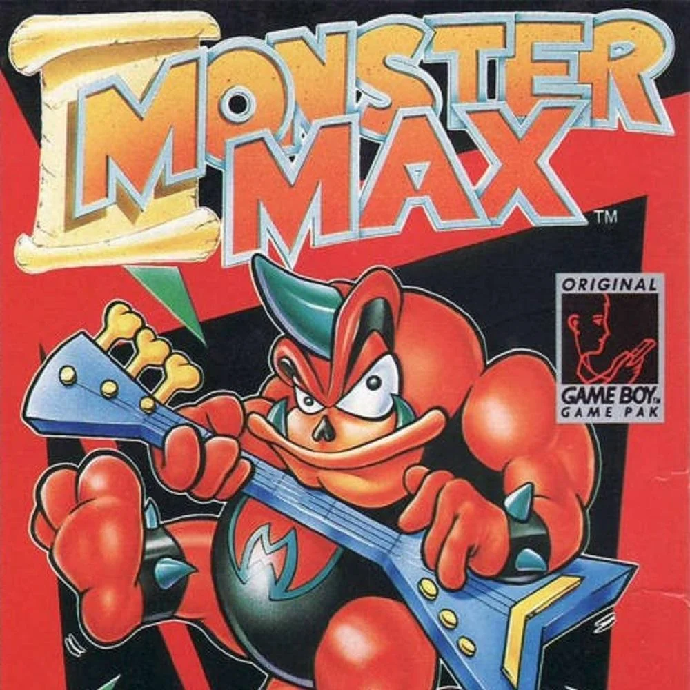

# 
 ra4111
Retro Achievements set design document for the game [Monster Max](https://retroachievements.org/game/4111) on the Game Boy

## Content:

1. [Design Doc](DESIGN.md)
1. [Code](4111.rascript)

## Commands:

|Title|Command|Parameters|Description|
|-|-|-|-|
|Compile|`make compile`|None|Compile RAScript into achievement logic|